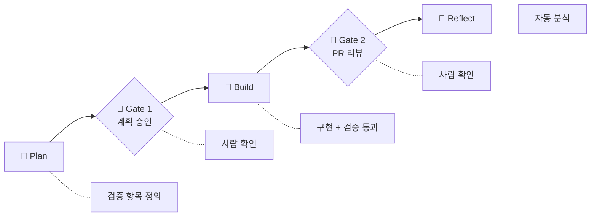
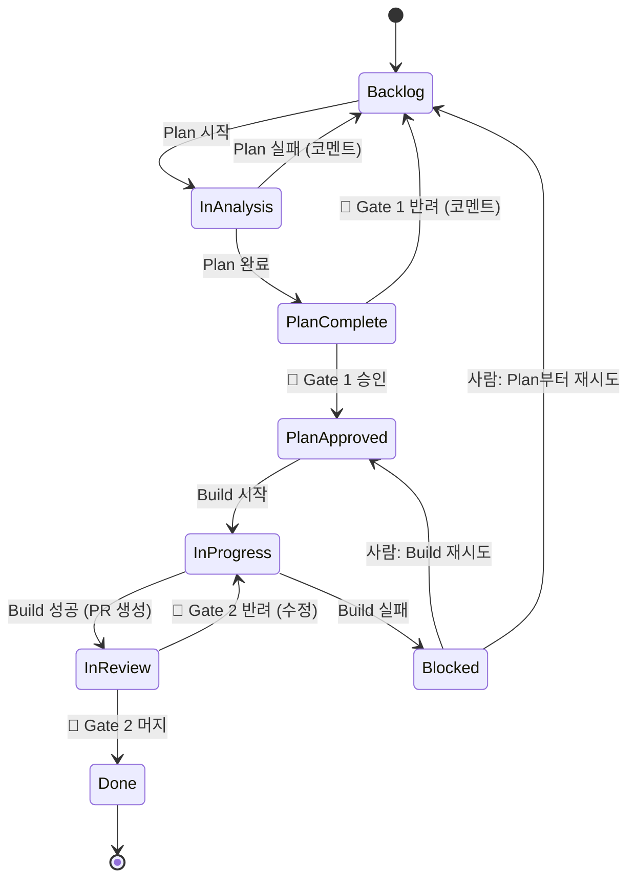
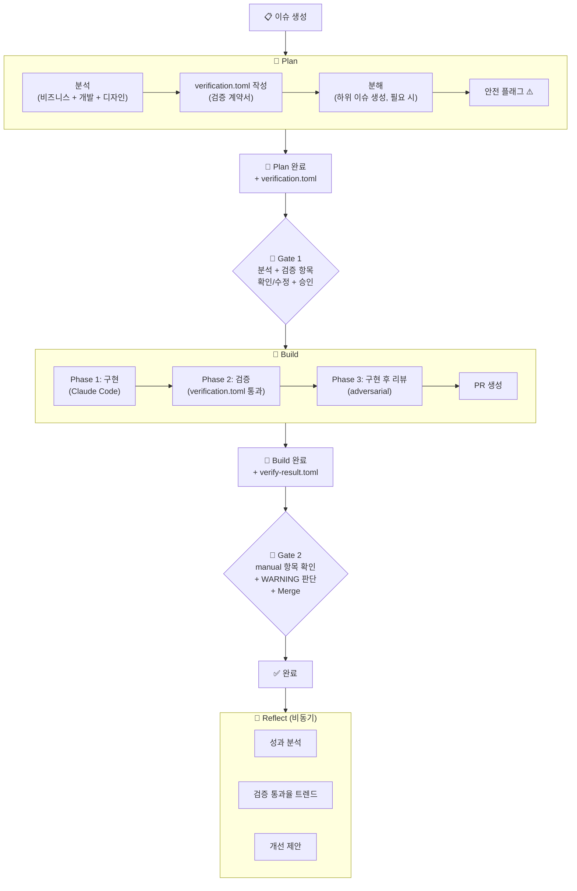

# 01. 프로세스 설계 개요

## 설계 원칙

1. **"사람이 승인해야 하는 순간"을 기준으로 단계를 나눈다.**
2. **Plan이 검증 계약을 정의하고, Build가 이를 통과시킨다.**
3. **아티팩트는 TOML 형식으로 통일한다.**

---

## 사람의 승인이 필요한 상황

### 반드시 사람이 판단해야 하는 것 (자동화 불가)

| 상황 | 이유 | 예시 |
|------|------|------|
| **무엇을 만들 것인가** | 사업적 판단, 우선순위 | "이 기능을 지금 만들어야 하나?" |
| **요구사항 해석의 모호함** | 의도를 아는 건 작성자뿐 | "편리하게 → 구체적으로 뭘 의미?" |
| **트레이드오프 선택** | 정답 없는 판단 | "속도 vs 정확도" |
| **외부 이해관계자 영향** | 조직 컨텍스트 | "다른 팀 일정에 영향?" |
| **코드 머지 최종 승인** | 프로덕션 책임 | PR approve → merge |
| **배포 결정** | 장애 리스크 | "금요일 오후에 배포?" |

### 안전상 사람이 확인해야 하는 것 (조건부 자동화)

| 상황 | 리스크 | 자동화 조건 |
|------|--------|------------|
| **DB 스키마 변경** | 데이터 유실 | 테스트 + 롤백 계획 |
| **인증/권한 변경** | 보안 취약점 | 보안 테스트 자동화 |
| **결제/과금 로직** | 금전적 손실 | 샌드박스 테스트 |
| **데이터 삭제** | 비가역적 | dry-run 확인 |
| **외부 API 변경** | 하위 호환성 | API 버전 관리 |
| **새 의존성 도입** | 라이선스/보안 | 허용 목록 기반 |

### AI가 자율 처리 가능한 것

요구사항 분석, 코드 구현, 테스트, 린트, PR 생성, 문서 생성, 상태 업데이트, 메트릭 수집

---

## 전체 프로세스 흐름

---

## 이슈 상태 전이

---

## 전체 흐름 상세

---

다음 문서: [02. Plan 단계](./02-plan-stage.md)
