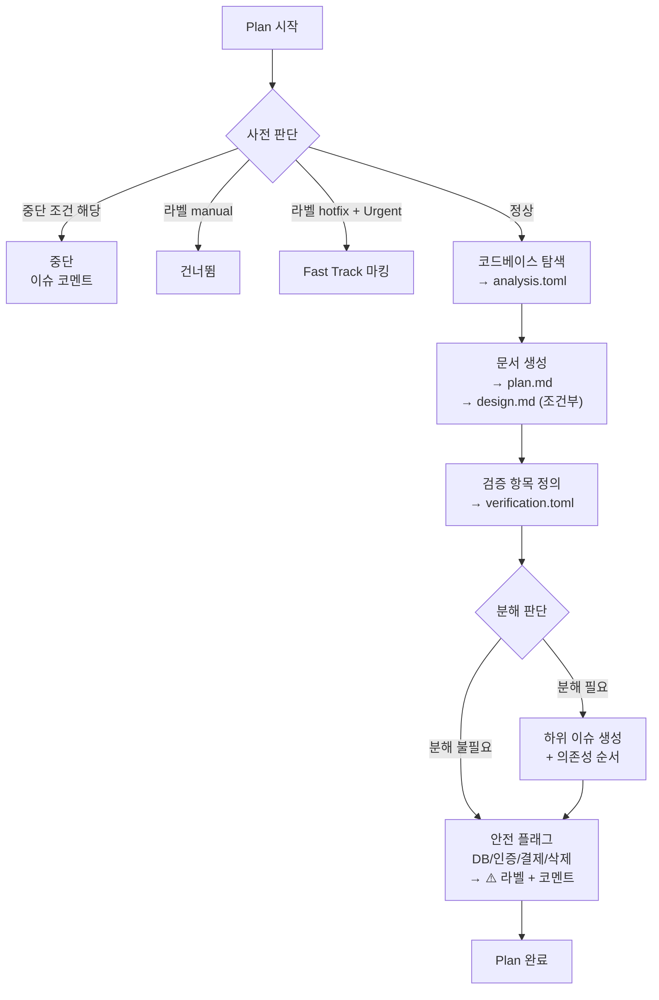
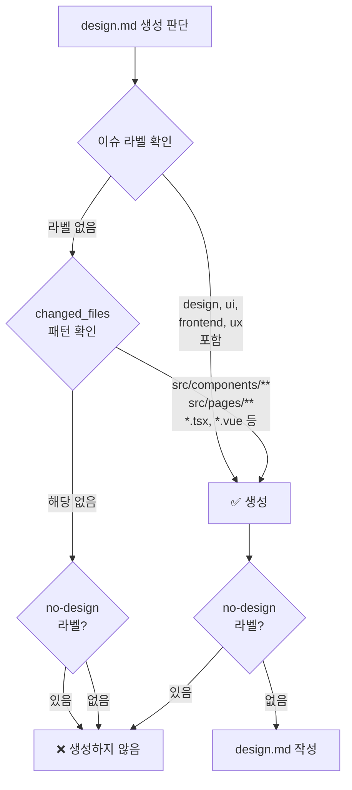

# 02. Stage 1: Plan (자동)

**담당**: ProductOwnerAgent

---

## Plan 입력: 이슈 데이터

Plan은 이슈 관리 도구의 API에서 이슈 데이터를 수신한다.

### 이슈에 포함되어야 하는 것

이슈 작성자(사람)가 제공해야 하는 최소 정보:

```markdown
## 목표
한 문장: "완료"가 무엇인지.
예: "사용자가 프로필 페이지에서 이름을 수정할 수 있다"

## 요구사항
WHEN/THEN 형식의 번호 목록:
1. WHEN 사용자가 PUT /api/users/{id} 호출 THEN 이름이 변경되고 200 응답
2. WHEN 빈 이름으로 요청 THEN 400 에러 + 에러 메시지 반환
3. WHEN 존재하지 않는 사용자 THEN 404 에러

## 범위 밖 (Non-Goals)
이 이슈에서 하지 않는 것:
- 이메일 변경은 별도 이슈로
- 프로필 이미지는 다루지 않음
```

### 좋은 이슈 vs 나쁜 이슈

| | 좋은 이슈 | 나쁜 이슈 |
|---|---|---|
| 목표 | "PUT API로 이름 수정, 빈 값 거부" | "프로필 기능 개선" |
| 요구사항 | WHEN/THEN + 측정 가능한 기준 | "직관적으로 동작해야 함" |
| 범위 | Non-Goals 명시 | 범위 언급 없음 (에이전트가 확대 해석) |
| 길이 | 50-100줄 | 300줄 이상 (후반부 무시됨) |

### Plan 중단 조건

다음 중 하나라도 해당하면 Plan을 중단하고 코멘트로 이유를 남긴다:
- `description`이 비어 있음
- 목표 문장을 추출할 수 없음
- 요구사항이 WHEN/THEN 등 검증 가능한 형태가 아님

이 데이터는 `issue.toml`로 저장되어 이후 단계에서 재사용된다.

---

## Plan이 하는 일



---

## plan.md — 구현 계획서

Build(DeveloperAgent)가 읽고 구현하는 **유일한 핵심 문서**.
이 문서와 코드베이스만으로 구현할 수 있어야 한다 (자급자족 원칙).

### 작성 원칙

- **150줄 이하**. 넘으면 이슈를 분해해야 한다.
- **자급자족**: 이 문서 + 코드베이스만으로 구현 가능해야 한다. 외부 문서 참조 금지.
- **구체적**: "적절히 처리", "깔끔하게" 같은 모호한 표현 금지. 파일명, 함수명, 조건을 명시.
- **경계 명시**: 수정할 파일뿐 아니라 **수정하면 안 되는 파일**도 명시.
- **의존성 순서**: 작업은 선행 조건이 먼저 오도록 정렬.

### 템플릿

```markdown
# [이슈번호]: [제목]

## 목표
한 문장: 완료 상태 정의.

## 영향 범위

수정 대상:
| 파일 | 변경 내용 |
|------|----------|
| `src/api/users.py` | `update_user()` 함수 추가 |
| `src/models/user.py` | `User.update_name()` 메서드 추가 |
| `tests/test_users.py` | 수정/실패/404 테스트 3개 추가 |

수정 금지:
- `src/api/auth.py` — 인증 로직 변경 없음
- `src/models/base.py` — 베이스 모델 변경 없음
- `alembic/` — DB 스키마 변경 없음

신규 의존성: 없음 (기존 라이브러리만 사용)

## 작업 (의존성 순서)

1. `src/models/user.py` — User 모델에 `update_name(new_name: str)` 메서드 추가
   - 빈 문자열이면 `ValueError` raise
   - 기존 `update()` 패턴을 따를 것
   - 검증: `uv run pytest tests/test_models.py -k user`

2. `src/api/users.py` — `PUT /api/users/{id}` 엔드포인트 추가
   - 기존 `GET /api/users/{id}` 패턴을 따를 것
   - 입력: `{"name": "string"}` (Pydantic 모델로 검증)
   - 응답: 200 + 수정된 User 객체 / 400 / 404
   - 검증: `uv run pytest tests/test_users.py`

3. `tests/test_users.py` — 테스트 추가
   - WHEN 유효한 이름 THEN 200 + 이름 변경됨
   - WHEN 빈 이름 THEN 400 + 에러 메시지
   - WHEN 없는 사용자 THEN 404

## 참고할 기존 패턴
- `GET /api/users/{id}` (src/api/users.py:45) — 라우터 구조 참조
- `User.update_email()` (src/models/user.py:78) — 수정 메서드 패턴 참조
```

### 포함해야 하는 것

| 섹션 | 역할 | 왜 필요한가 |
|------|------|------------|
| **목표** | "완료"의 정의 | 에이전트가 범위를 벗어나지 않게 |
| **수정 대상** | 파일 + 구체적 변경 내용 | 에이전트가 어디를 건드려야 하는지 |
| **수정 금지** | 건드리면 안 되는 파일 | **가장 자주 빠지는 섹션**. 없으면 에이전트가 멀쩡한 코드를 "개선"함 |
| **신규 의존성** | 새 라이브러리 여부 | 없음이면 명시. 있으면 에스컬레이션 대상 |
| **작업 (의존성 순서)** | 번호 + 파일 + 내용 + 검증 명령 | 에이전트가 순서대로 실행. 각 작업이 독립 검증 가능 |
| **참고할 기존 패턴** | 파일:줄번호 | 에이전트가 기존 코드와 일관된 스타일로 작성 |

### 포함하면 안 되는 것

| 항목 | 이유 |
|------|------|
| 코드 스타일 가이드 | 린터가 할 일. CLAUDE.md에 이미 있음 |
| 모호한 형용사 ("깔끔하게", "효율적으로") | 에이전트가 해석할 수 없음. 구체적 기준으로 대체 |
| 구현 코드 예시 | 에이전트의 문제 해결 능력을 제한함. 패턴 참조로 충분 |
| 배경/비즈니스 맥락 | issue.toml에 있음. 중복은 모순 위험 |
| 엣지 케이스 나열 (10개 이상) | 원칙을 명시하고 에이전트가 도출하게 함. 나열하면 목록 밖을 무시 |
| 200줄 초과 내용 | 후반부가 무시됨. 이슈를 분해해야 한다는 신호 |

### 150줄 초과 시 자동 분해 기준

Plan이 plan.md 작성 중 150줄을 초과할 것으로 예상되면 분해를 판단한다.

**분해 권장 조건** (하나라도 해당 시):

1. `changed_files`가 5개 이상
2. `stages`에서 `complexity = "complex"`가 2개 이상
3. `design.md`가 필요하고 + 백엔드 변경도 있음 (프론트+백 동시 변경)
4. 요구사항(WHEN/THEN)이 7개 이상
5. 새 의존성 도입이 포함

**분해하지 않는 경우**:

- `changed_files`가 5개 이상이지만 모두 같은 패턴의 반복 수정 (예: i18n 키 추가)
- `stages`는 많지만 모두 `complexity = "simple"`

---

## design.md — UI/UX 설계서 (조건부)

화면 변경이 포함된 이슈에서만 생성.
**비주얼이 아닌 동작(behavior)을 정의**하는 문서.

### 생성 조건



### 작성 원칙

- **100줄 이하**.
- **동작 중심**: 컴포넌트가 "어떻게 생겼는가"가 아니라 "무엇을 하는가".
- **상태 명시**: 모든 컴포넌트의 상태(default/loading/error/empty/success)를 정의.
- **기존 컴포넌트 우선**: 새로 만들기 전에 재사용 가능한 기존 컴포넌트를 명시.

### 템플릿

```markdown
# [이슈번호]: [제목] UI 설계

## 컴포넌트

### ProfileEditForm (신규)
- 위치: `src/components/profile/ProfileEditForm.tsx`
- props: `{ currentName: string, onSubmit: (name: string) => Promise<void> }`
- 상태:
  | 상태 | 조건 | 동작 |
  |------|------|------|
  | default | 초기 | 현재 이름 표시 + 수정 버튼 |
  | editing | 수정 버튼 클릭 | 입력 필드 + 저장/취소 |
  | loading | 저장 요청 중 | 입력 비활성화 + 스피너 |
  | error | API 에러 | 입력 필드 하단 에러 메시지 |
  | invalid | 빈 입력 | 실시간 유효성 메시지 |

### ProfilePage (수정)
- 파일: `src/pages/ProfilePage.tsx`
- 변경: `<UserInfo>` 아래에 `<ProfileEditForm>` 추가
- 데이터 흐름: ProfilePage → API 호출 → ProfileEditForm에 콜백 전달

## 재사용할 기존 컴포넌트
- `<Input>` — `src/components/common/Input.tsx`
- `<Button>` — `src/components/common/Button.tsx`
- `<Spinner>` — `src/components/common/Spinner.tsx`

## 상태 관리
- 상태 위치: ProfileEditForm 내부 (로컬 상태)
- API 호출: `PUT /api/users/{id}` (plan.md의 작업 2와 대응)

## 접근성
- 입력 필드: `aria-label="사용자 이름"`
- 에러 메시지: `aria-live="polite"`
- 키보드: Tab으로 수정→저장→취소 순서 이동
```

### 포함해야 하는 것

| 섹션 | 역할 |
|------|------|
| **컴포넌트** | 이름 + 파일 경로 + props + **상태 테이블** |
| **재사용할 기존 컴포넌트** | 새로 만들지 않을 것을 명시 |
| **상태 관리** | 상태가 어디에 살고, 데이터가 어떻게 흐르는지 |
| **접근성** | ARIA, 키보드 네비게이션 (최소한) |

### 포함하면 안 되는 것

| 항목 | 이유 |
|------|------|
| 픽셀 단위 치수 | 디자인 토큰/기존 컴포넌트로 충분 |
| 색상 코드 직접 지정 | 디자인 시스템 변수를 참조해야 함 |
| 스크린샷만으로 설명 | 에이전트는 상태/props/동작이 필요 |
| 레이아웃 CSS 상세 | 기존 레이아웃 패턴 참조로 충분 |

---

다음 문서: [03. Build 단계](./03-build-stage.md)
