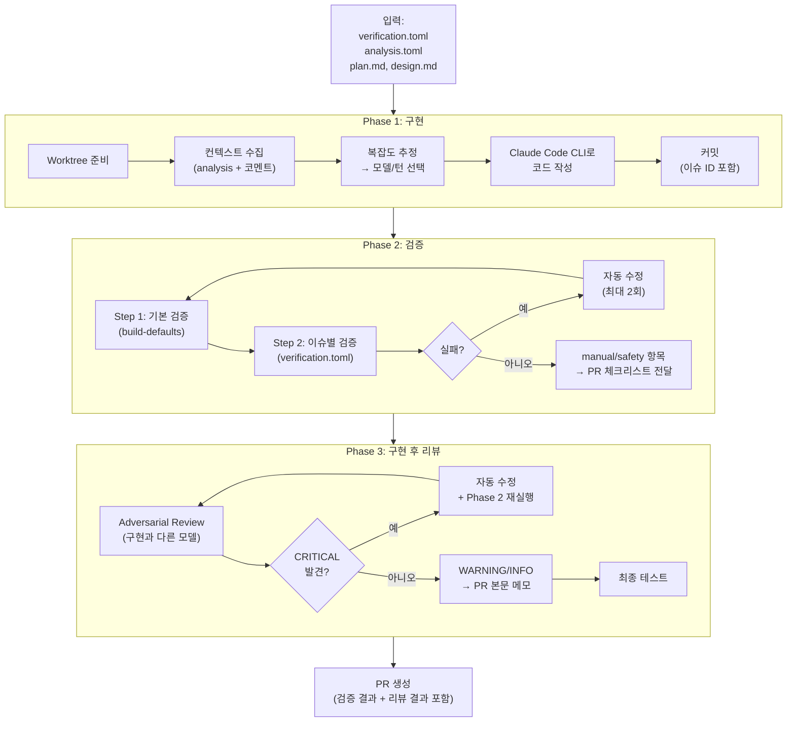
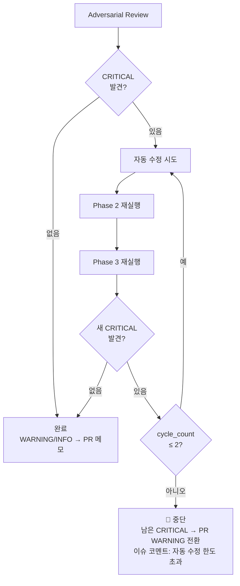
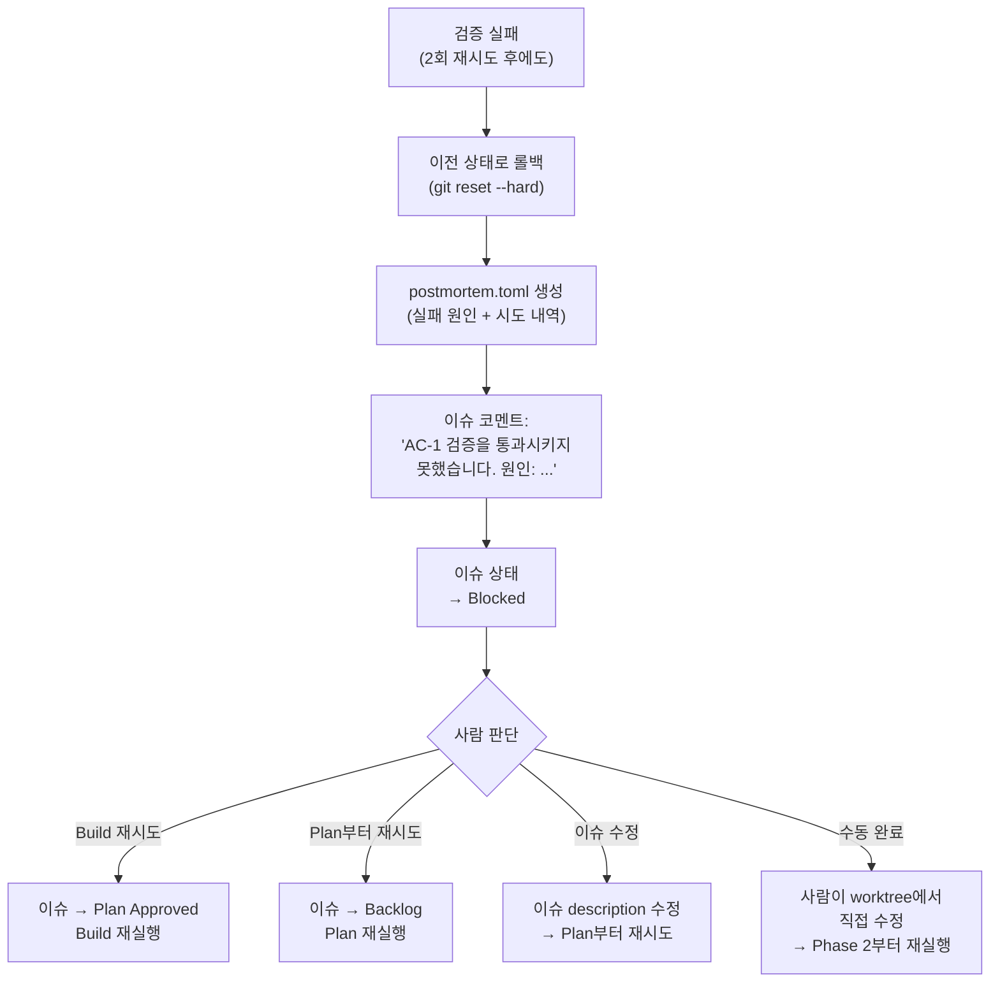

# 03. Stage 2: Build (자동)

**담당**: DeveloperAgent

---

## Build 전체 흐름

Build는 **세 Phase**로 나뉜다:



---

## 검증 2계층: 기본 검증 + 이슈별 검증

```
Build 검증 = 기본 검증 (항상 실행, 프로젝트 설정)
           + 이슈별 검증 (Plan이 작성, verification.toml)
```

### 기본 검증 — Build 내장

매 이슈마다 반복되는 기술 검증은 **프로젝트 설정 파일**에서 관리한다.
verification.toml에 쓰지 않는다.

```toml
# pyproject.toml 또는 .cogniq/build-defaults.toml (프로젝트 루트)

[verify.lint]
enabled = true
command = "ruff check {changed_files}"
auto_fix = true
max_retries = 2

[verify.typecheck]
enabled = true
command = "ruff check --select ANN {changed_files}"
auto_fix = true
max_retries = 2

[verify.test]
enabled = true
command = "uv run pytest"
allow_preexisting_failures = true
auto_fix = true
max_retries = 2

[verify.secret_scan]
enabled = true
command = "git diff --cached | grep -iE '(api_key|secret|password|token|private_key)\\s*=\\s*[\"\\x27]' && exit 1 || exit 0"
description = "커밋에 시크릿이 포함되었는지 검사"
auto_fix = false
max_retries = 0
on_failure = "escalate"
```

Build는 이 항목을 **무조건 실행**한다. 실패 시 자동 수정 후 재시도 (최대 2회).
`secret_scan` 실패 시에는 자동 수정 없이 즉시 에스컬레이션.

### verification.toml — 이슈별 검증 계약서

Plan이 작성하고, Build가 이행해야 하는 **해당 이슈에 특화된** 계약서.
기본 검증에서 이미 다루는 항목(린트, 기존 테스트, 타입 힌트)은 포함하지 않는다.

```toml
# .cogniq/verification.toml

[meta]
issue_id = "COG-42"
created_by = "plan"
created_at = "2026-03-28T10:00:00+09:00"

# ── 기능 검증: 이 이슈의 요구사항을 정확히 구현했는가 ──

[[acceptance]]
id = "AC-1"
description = "프로필 페이지에서 사용자 이름을 수정할 수 있다"
verify_method = "test"      # test | existence | manual
expected = "PUT /api/users/{id} 호출 시 이름 변경 + 200 응답"

[[acceptance]]
id = "AC-2"
description = "빈 이름으로 수정 시 400 에러를 반환한다"
verify_method = "test"
expected = "400 Bad Request + 에러 메시지"

# ── 안전 검증: 리스크가 있는 변경에 대한 추가 확인 ──
# (Plan이 안전 플래그를 감지했을 때만 생성)

[[safety]]
id = "SF-1"
description = "DB 마이그레이션 스크립트가 롤백 가능하다"
verify_method = "manual"
flag = "db_schema"
note = "사람이 PR 리뷰 시 확인 필요"
```

#### verification.toml 항목 유형

| 유형 | 설명 | 자동 검증 |
|------|------|----------|
| `acceptance` | 이 이슈의 요구사항 충족 여부 | `test`/`existence`는 자동, `manual`은 PR 체크리스트 |
| `safety` | 안전 리스크 확인 (조건부 생성) | `manual` → PR 리뷰 시 사람이 확인 |

#### verify_method 종류

| method | 설명 | 자동 검증 |
|--------|------|----------|
| `test` | 이 이슈 관련 테스트 실행으로 확인 | O |
| `existence` | 특정 파일/함수/테스트 존재 여부 확인 | O |
| `manual` | 사람이 PR 리뷰 시 확인 | X → PR 체크리스트에 포함 |

---

## verification.toml → verify-result.toml

Build가 검증을 실행한 결과를 기록한다.

```toml
# .cogniq/verify-result.toml

[meta]
issue_id = "COG-42"
verified_by = "build"
verified_at = "2026-03-28T10:30:00+09:00"
overall_status = "pass"           # pass | fail | partial

# ── 기본 검증 결과 (build-defaults) ──

[defaults]
lint = { status = "pass", attempts = 2, fix_summary = "import 순서 정리" }
typecheck = { status = "pass", attempts = 1 }
test = { status = "pass", attempts = 1, detail = "28 passed, 2 skipped" }
secret_scan = { status = "pass", attempts = 1 }

# ── 이슈별 검증 결과 (verification.toml) ──

[[result]]
id = "AC-1"
status = "pass"
detail = "test_update_profile 통과"
attempts = 1

[[result]]
id = "AC-2"
status = "pass"
detail = "test_update_profile_empty_name 통과"
attempts = 1

[[result]]
id = "SF-1"
status = "skip"
detail = "manual 항목 — PR 체크리스트에 포함됨"

# ── 구현 후 리뷰 (adversarial) ──

[post_review]
model_used = "claude-opus-4-6"
findings_critical = 0
findings_warning = 1
findings_info = 2

[[post_review.finding]]
severity = "warning"
description = "update_profile()에서 동시 수정 시 race condition 가능성"
suggestion = "optimistic locking 또는 last-write-wins 전략 적용"
auto_fixed = false

[[post_review.finding]]
severity = "info"
description = "ProfileSerializer에 불필요한 필드 포함"
suggestion = "read_only_fields에 created_at 추가"
auto_fixed = true
```

---

## Adversarial Review 무한 루프 방지

Phase 3에서 CRITICAL → 자동 수정 → 재검증 → 새 CRITICAL 발견 시 무한 루프가 가능하다.



---

## Build 실패 시 동작



### postmortem.toml 카테고리

| category | 설명 | 예시 |
|----------|------|------|
| `transient` | 일시적 오류 (재시도로 해결 가능) | 네트워크 타임아웃, 의존 서비스 일시 장애 |
| `permanent` | 구조적 문제 (코드/설계 수정 필요) | 잘못된 API 설계, 누락된 의존성 |
| `quality` | 품질 미달 (검증 기준 미충족) | 테스트 실패, 타입 오류 |
| `timeout` | 시간/턴 초과 | max_turns 초과, phase 타임아웃 |
| `cost_limit` | 비용 상한 초과 | max_cost_usd 초과 |

---

## PR 본문 생성

Build 완료 시 PR 본문에 포함되는 정보:

```markdown
## 변경 요약
- 프로필 수정 API 엔드포인트 추가 (PUT /api/users/{id})
- 입력값 검증 로직 구현
- 테스트 3개 추가

## 기본 검증
✅ lint — 통과 (자동 수정 1회: import 순서 정리)
✅ typecheck — 통과
✅ test — 통과 (28 passed, 2 skipped)
✅ secret_scan — 통과

## 이슈별 검증 (verification.toml)
✅ AC-1: 프로필 이름 수정 — 통과
✅ AC-2: 빈 이름 400 에러 — 통과
⏭️ SF-1: DB 마이그레이션 롤백 — 수동 확인 필요

## 구현 후 리뷰
⚠️ WARNING: update_profile() race condition 가능성 → 검토 필요
ℹ️ INFO: ProfileSerializer 불필요 필드 (auto-fixed)

## 수동 확인 체크리스트
- [ ] SF-1: DB 마이그레이션 스크립트 롤백 가능 여부
- [ ] WARNING: race condition 허용 여부 판단
```

---

다음 문서: [04. Gate 및 Reflect](./04-gates-and-reflect.md)
