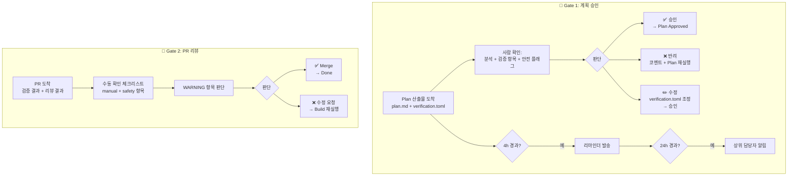
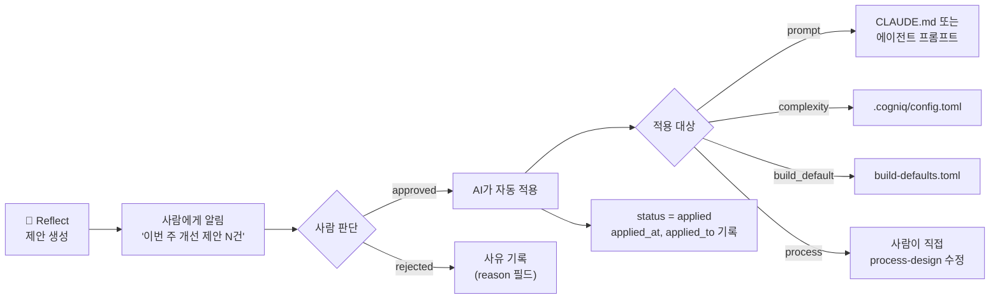

# 04. Gate 및 Reflect

---

## Gate 1: 계획 승인

### 사람이 확인하는 것

1. 분석 결과가 의도와 맞는가?
2. verification.toml의 검증 항목이 적절한가?
   - 빠진 검증 항목은 없는가?
   - 불필요하게 과한 항목은 없는가?
3. 안전 플래그 (⚠️) 확인
4. 수정 사항이 있으면 코멘트 후 다시 Plan
5. 승인: 이슈 상태를 다음 단계로 변경

### verification.toml 수정 권한

**사람이 verification.toml을 수정할 수 있다**:
- 검증 항목 추가/삭제/수정 가능
- 이슈 코멘트로 지시하면 AI가 반영
- 직접 파일을 수정해도 됨

### Gate 1 타임아웃

```toml
# .cogniq/config.toml

[gates.gate1]
reminder_after = "4h"        # 4시간 미승인 시 리마인더
escalate_after = "24h"       # 24시간 미승인 시 상위 담당자에게 알림
auto_action = "none"         # none | auto_approve_fast_track
```

- `auto_approve_fast_track`: Fast Track 조건에 해당하는 이슈는 24시간 후 자동 승인 (설정으로 활성화)

---

## Gate 2: PR 리뷰 + Merge

### 사람이 확인하는 것

1. `manual` 항목 체크리스트 확인
2. WARNING 항목에 대한 판단
3. 코드 전체적인 방향성
4. 머지 결정

### Gate 2 타임아웃

```toml
# .cogniq/config.toml

[gates.gate2]
reminder_after = "8h"        # 8시간 미머지 시 리마인더
escalate_after = "48h"       # 48시간 미머지 시 상위 담당자에게 알림
auto_action = "none"         # none | auto_merge_if_ci_green
```

- `auto_merge_if_ci_green`: CI 전부 통과 + safety/manual 항목 없는 경우 48시간 후 자동 머지 (설정으로 활성화)

---

## Gate 흐름 다이어그램



---

## Stage 3: Reflect (자동, 비동기)

**트리거**: 주기적 (매주) 또는 N개 이슈 완료 후

### 분석 항목

1. **성과 지표** — 성공률, 실행시간, 비용
2. **verification 통과율** — 어떤 유형이 자주 실패하는가
3. **재시도 패턴** — 어떤 검증이 1차에 실패하고 자동 수정되는가
4. **adversarial 발견 패턴** — 반복되는 WARNING 유형
5. **복잡도 추정 정확도** — 모델/턴 선택이 적절했는가

### Reflect 출력

- `.cogniq/retros/{date}.toml` — 주간 회고 스냅샷
- `.cogniq/retros/trend.toml` — 트렌드 비교 (매주 갱신)
- 개선 제안 (프롬프트 힌트, 복잡도 기준 조정)
- 적용은 사람이 승인

### 제안 추적 흐름



### 제안 상태

```toml
# .cogniq/retros/2026-03-28.toml — suggestions 섹션

[[suggestions]]
id = "SUG-2026-03-28-001"
type = "prompt"                       # prompt | complexity | build_default | process
description = "테스트 실행 전 DB 연결 확인 단계 추가"
priority = "high"
status = "pending"                    # pending | approved | applied | rejected
applied_at = ""
applied_to = ""
```

### 트렌드 비교

```toml
# .cogniq/retros/trend.toml

[trend]
updated_at = "2026-03-28"
weeks_tracked = 4

[[trend.metrics]]
name = "success_rate"
values = [0.75, 0.78, 0.80, 0.83]
direction = "improving"

[[trend.metrics]]
name = "first_pass_rate"
values = [0.60, 0.62, 0.68, 0.70]
direction = "improving"

[[trend.metrics]]
name = "avg_cost_usd"
values = [0.35, 0.32, 0.30, 0.28]
direction = "improving"

[[trend.recurring_warnings]]
description = "에러 핸들링 부족"
count_by_week = [3, 4, 2, 3]
suggestion = "Plan 프롬프트에 에러 핸들링 체크리스트 추가"
```

---

## 알림 규칙

### 설정

```toml
# .cogniq/config.toml

[notifications]
channel = "slack"                     # slack | linear_comment | both
slack_channel = "#cogniq-updates"

[notifications.triggers]
plan_complete = true                  # Plan 완료 → 승인 요청
gate1_reminder = "4h"                # Gate 1 미승인 시 리마인더
build_success = true                  # Build 성공 → PR 리뷰 요청
build_failure = true                 # Build 실패 → 사람 확인 요청
gate2_reminder = "8h"                # Gate 2 미머지 시 리마인더
conflict_detected = true             # 파일 충돌 감지
sub_issue_blocked = true             # 하위 이슈 실패로 대기 발생
```

### 알림 메시지 형식

```
# Plan 완료 알림
🤖 COG-42 Plan 완료 — 승인 대기
  ├─ 수정 대상: src/api/users.py 외 2개
  ├─ 검증 항목: AC 2개, SF 0개
  ├─ 안전 플래그: 없음
  └─ 링크: [Plan 보기] [이슈 보기]

# Build 실패 알림
🔴 COG-42 Build 실패
  ├─ 실패 단계: Phase 2 (검증)
  ├─ 실패 항목: AC-2 (빈 이름 400 에러)
  ├─ 재시도 횟수: 2/2
  ├─ 원인 요약: DB 연결 실패
  └─ 링크: [postmortem 보기] [이슈 보기]
```

---

다음 문서: [05. 아티팩트](./05-artifacts.md)
