# 05. 아티팩트

---

## 디렉토리 구조

```
.worktrees/{branch}/
  .cogniq/
    # ── Plan 산출 ──
    issue.toml              ← Plan: 이슈 스냅샷 (외부 데이터 로컬 캐시)
    analysis.toml           ← Plan: 3관점 분석 결과
    verification.toml       ← Plan: 검증 계약서
    plan.md                 ← Plan: 구현 계획 (문서)
    design.md               ← Plan: 설계 문서 (문서, 조건부)

    # ── Build 산출 ──
    build-result.toml       ← Build: 구현 메타데이터 (브랜치, 커밋, PR)
    verify-result.toml      ← Build: 검증 실행 결과
    review.md               ← Build: PR 요약 (문서)
    postmortem.toml         ← Build: 실패 시 원인 분석
    postmortem-{n}.toml     ← Build: 재시도 시 이전 실패 기록 보존

    # ── 런타임 ──
    locks.toml              ← 파일 잠금 레지스트리 (프로젝트 루트, main 기준)
    run.lock                ← 실행 잠금 (중복 실행 방지)

    # ── Reflect 산출 (프로젝트 루트) ──
    retros/
      {date}.toml           ← Reflect: 주간 회고 스냅샷
      trend.toml            ← Reflect: 트렌드 비교 (매주 갱신)
```

---

## 단계별 입력/산출 매핑

```mermaid
flowchart LR
    subgraph Plan_Input["Plan 입력"]
        PI1["이슈 API (외부)"]
    end

    subgraph Plan_Output["Plan 산출"]
        PO1["issue.toml"]
        PO2["analysis.toml"]
        PO3["verification.toml"]
        PO4["plan.md"]
        PO5["design.md<br/>(조건부)"]
    end

    Plan_Input --> Plan_Output

    Plan_Output -->|"🧑 Gate 1<br/>verification.toml<br/>수정 가능"| Build_Input

    subgraph Build_Input["Build 입력"]
        BI1["issue.toml"]
        BI2["analysis.toml"]
        BI3["verification.toml"]
        BI4["plan.md"]
        BI5["design.md"]
    end

    subgraph Build_Output["Build 산출"]
        BO1["build-result.toml"]
        BO2["verify-result.toml"]
        BO3["review.md"]
        BO4["postmortem.toml<br/>(실패 시)"]
    end

    Build_Input --> Build_Output

    Build_Output -->|"🧑 Gate 2<br/>PR 리뷰 + Merge"| Reflect_Input

    subgraph Reflect_Input["Reflect 입력"]
        RI1["여러 이슈의<br/>build-result.toml"]
        RI2["여러 이슈의<br/>verify-result.toml"]
        RI3["postmortem.toml"]
    end

    subgraph Reflect_Output["Reflect 산출"]
        RO1["retros/{date}.toml"]
        RO2["retros/trend.toml"]
    end

    Reflect_Input --> Reflect_Output
```



---

## 단계별 입력/산출 상세

| 단계 | 읽기 (입력) | 쓰기 (산출) | 비고 |
|------|------------|------------|------|
| **Plan** | 이슈 API (외부) | `issue.toml`, `analysis.toml`, `plan.md`, `design.md`(조건부), `verification.toml` | 외부 → 로컬 캐시 + 분석 + 문서 + 검증 계약 |
| **Gate 1** | `plan.md`, `design.md`, `verification.toml` | `verification.toml` (수정 가능) | 사람이 문서를 읽고 검증 항목 조정 |
| **Build P1** | `issue.toml`, `analysis.toml`, `plan.md`, `design.md` | 코드 변경 + 커밋, `build-result.toml` | plan.md가 핵심 구현 가이드 |
| **Build P2** | `build-defaults.toml`(프로젝트), `verification.toml` | `verify-result.toml` | 기본 검증 → 이슈별 검증 순서 |
| **Build P3** | 코드 변경 (git diff) | `verify-result.toml`에 post_review 추가 | 코드가 있어야 확인 가능한 것만 |
| **Build Ship** | `verify-result.toml`, `build-result.toml` | `review.md`, PR (외부) | 검증 결과를 PR 본문에 포함 |
| **Gate 2** | PR, `verify-result.toml`, `review.md` | 머지 결과 (외부) | manual/safety 항목 + WARNING 확인 |
| **Reflect** | 여러 이슈의 `build-result.toml` + `verify-result.toml` + `postmortem.toml` | `retros/{date}.toml`, `retros/trend.toml` | 비동기 수집 |

---

## Git 커밋 정책

### 커밋하는 것 (PR 브랜치에 포함)

| 파일 | 이유 |
|------|------|
| `verification.toml` | 리뷰어가 검증 항목을 확인해야 함 |
| `verify-result.toml` | 검증 결과가 PR에 첨부되어야 함 |
| `plan.md` | 리뷰어가 구현 계획을 볼 수 있어야 함 |
| `design.md` | 리뷰어가 UI 설계를 볼 수 있어야 함 |

### 커밋하지 않는 것 (.gitignore)

| 파일 | 이유 |
|------|------|
| `issue.toml` | 외부 API 캐시. 민감 정보(코멘트 등) 포함 가능 |
| `analysis.toml` | 내부 분석용. 코드에 대한 판단이 포함되어 공개 불필요 |
| `build-result.toml` | 비용/토큰 등 운영 정보. 별도 메트릭 시스템으로 관리 |
| `postmortem*.toml` | 디버깅용. 이슈 코멘트에 요약 첨부로 충분 |
| `locks.toml` | 런타임 상태. Git으로 관리하면 충돌 발생 |
| `run.lock` | 런타임 잠금 |
| `retros/` | 프로젝트 루트에서 관리. PR 브랜치와 무관 |

```gitignore
# .gitignore
.cogniq/issue.toml
.cogniq/analysis.toml
.cogniq/build-result.toml
.cogniq/postmortem*.toml
.cogniq/locks.toml
.cogniq/run.lock
.cogniq/retros/
```

---

## 산출물 덮어쓰기 규칙

| 재실행 단계 | 산출물 처리 |
|------------|-----------|
| **Plan 재실행** | `issue.toml`, `analysis.toml`, `verification.toml`, `plan.md`, `design.md` 모두 덮어쓰기. 이전 버전은 git history에서 확인 가능. |
| **Build 재실행** | `build-result.toml`, `verify-result.toml` 덮어쓰기. `postmortem.toml`은 `postmortem-{n}.toml`로 이력 보존. |

---

## 아티팩트 상세 스키마

### issue.toml

```toml
# .cogniq/issue.toml — Plan이 외부 API에서 가져온 이슈 데이터 캐시

[meta]
snapshot_at = "2026-03-28T10:00:00+09:00"

[issue]
id = "abc-123-def"
identifier = "COG-42"
title = "프로필 수정 기능 추가"
description = """
사용자가 프로필 페이지에서 이름을 수정할 수 있어야 한다.
빈 이름은 허용하지 않는다.
"""
priority = 2                          # 1=Urgent, 2=High, 3=Normal, 4=Low
labels = ["feature", "backend"]
project_id = ""
team_key = "COG"

[issue.comments]
count = 2
has_plan_marker = true
plan_comment_body = """
## 구현 계획
1. User 모델에 update_name 메서드 추가
2. PUT /api/users/{id} 엔드포인트 구현
3. 입력값 검증 (빈 이름 거부)
"""
```

### analysis.toml

```toml
# .cogniq/analysis.toml — Plan의 핵심 산출물

[meta]
issue_id = "COG-42"
created_by = "plan"
created_at = "2026-03-28T10:00:00+09:00"
fast_track = false

[business]
background = "사용자 프로필 수정은 MVP 핵심 기능"
feasibility = "기존 User 모델 활용, 추가 인프라 불필요"
completion_criteria = [
    "프로필 페이지에서 이름 수정 가능",
    "빈 이름 입력 시 에러 표시",
]

[development]
scope = "backend API 1개 엔드포인트 추가"
changed_files = [
    "src/api/users.py",
    "src/models/user.py",
    "tests/test_users.py",
]
stages = [
    { order = 1, description = "User 모델에 update_name 메서드", complexity = "low" },
    { order = 2, description = "PUT /api/users/{id} 엔드포인트", complexity = "medium" },
    { order = 3, description = "입력값 검증 로직", complexity = "low" },
]
estimated_complexity = "normal"       # simple | normal | complex
suggested_model = "claude-sonnet-4-6"
suggested_max_turns = 30

[design]
required = false
trigger = ""                          # label | file_pattern | explicit
trigger_detail = ""

[safety]
flags = []                            # ["db_schema", "auth", "payment", "deletion"]
notes = ""

[conflicts]
detected = false
items = []                            # [{ file, held_by, branch }]
recommendation = ""

[decompose]
should_split = false
strategy = ""                         # sequential | parallel | mixed
sub_issues = []
```

### build-result.toml

```toml
# .cogniq/build-result.toml — Build Phase 1 완료 후 생성

[meta]
issue_id = "COG-42"
created_by = "build"
started_at = "2026-03-28T10:15:00+09:00"
completed_at = "2026-03-28T10:28:00+09:00"
duration_seconds = 780

[execution]
model = "claude-sonnet-4-6"
max_turns = 30
actual_turns = 12
total_tokens = 45000
cost_usd = 0.32

[git]
branch = "agent/cog-42"
commits = [
    { hash = "a1b2c3d", message = "COG-42: Add profile update endpoint" },
    { hash = "d4e5f6g", message = "COG-42: Add input validation and tests" },
]
changed_files = [
    "src/api/users.py",
    "src/models/user.py",
    "tests/test_users.py",
]
insertions = 120
deletions = 5

[pr]
url = "https://github.com/owner/repo/pull/42"
number = 42
title = "COG-42: 프로필 수정 기능 추가"
```

### postmortem.toml

```toml
# .cogniq/postmortem.toml — Build 실패 시 생성

[meta]
issue_id = "COG-42"
created_by = "build"
failed_at = "2026-03-28T10:25:00+09:00"
phase = "verify"                      # implement | verify | review

[failure]
item_id = "AC-2"
description = "pytest 실행 중 test_update_profile 실패"
error_message = "AssertionError: expected 200, got 500"
category = "permanent"                # transient | permanent | quality | timeout | cost_limit

[attempts]
count = 3
details = [
    { attempt = 1, action = "initial implementation", result = "AC-2 fail" },
    { attempt = 2, action = "fix: response status code", result = "AC-2 fail" },
    { attempt = 3, action = "fix: database connection", result = "AC-2 fail" },
]

[context]
model = "claude-sonnet-4-6"
turns_used = 30
tokens_used = 60000
cost_usd = 1.80
```

### retros/{date}.toml

```toml
# .cogniq/retros/2026-03-28.toml — Reflect 주간 회고

[meta]
period_start = "2026-03-21"
period_end = "2026-03-28"
issues_processed = 12

[metrics]
success_rate = 0.83
avg_duration_seconds = 650
avg_tokens = 42000
avg_cost_usd = 0.28
total_cost_usd = 3.36

[verification]
first_pass_rate = 0.70
most_failed_type = "test"
auto_fix_success_rate = 0.85

[adversarial]
total_findings = 18
critical = 2
warning = 7
info = 9
most_common_warning = "에러 핸들링 부족"

[complexity_accuracy]
overestimated = 2
underestimated = 1
accurate = 9

[failures]
total = 2
by_category = { transient = 0, permanent = 1, quality = 1 }
common_patterns = [
    "테스트 환경 설정 누락으로 인한 DB 연결 실패",
]

[[suggestions]]
id = "SUG-2026-03-28-001"
type = "prompt"
description = "테스트 실행 전 DB 연결 확인 단계 추가"
priority = "high"
status = "pending"
applied_at = ""
applied_to = ""
```

---

## 왜 TOML인가

- **사람이 읽고 수정하기 쉽다** — Gate 1에서 verification.toml 직접 편집 가능
- **구조화되어 있다** — Build가 파싱하여 자동 검증 실행
- **주석을 지원한다** — 각 항목에 맥락 설명 가능
- **Git diff가 깔끔하다** — JSON보다 변경 내역 추적이 용이

---

다음 문서: [06. 운영](./06-operations.md)
