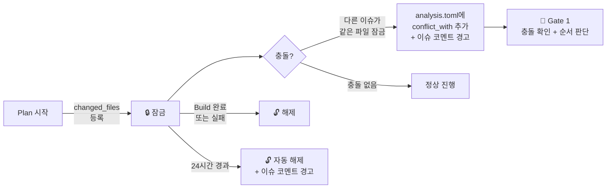
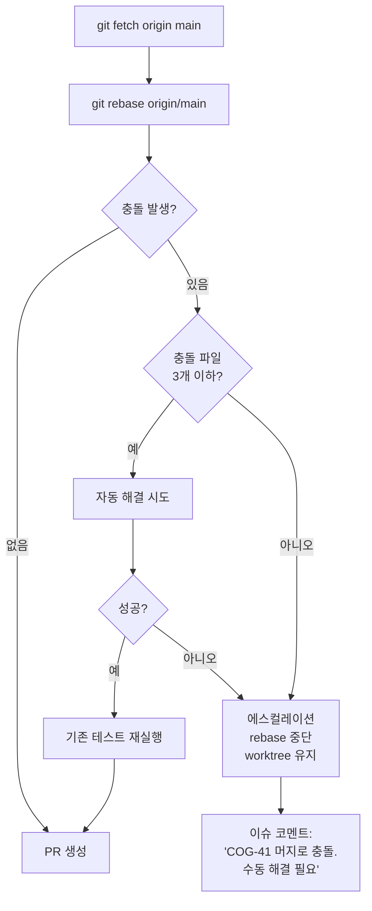
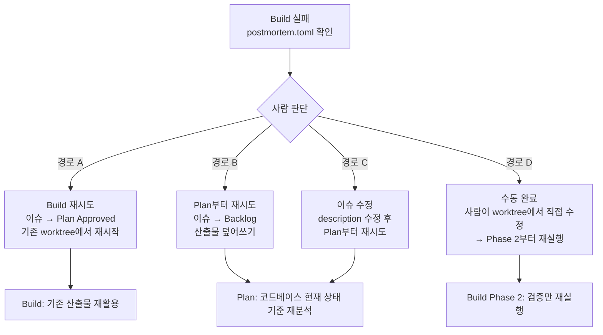
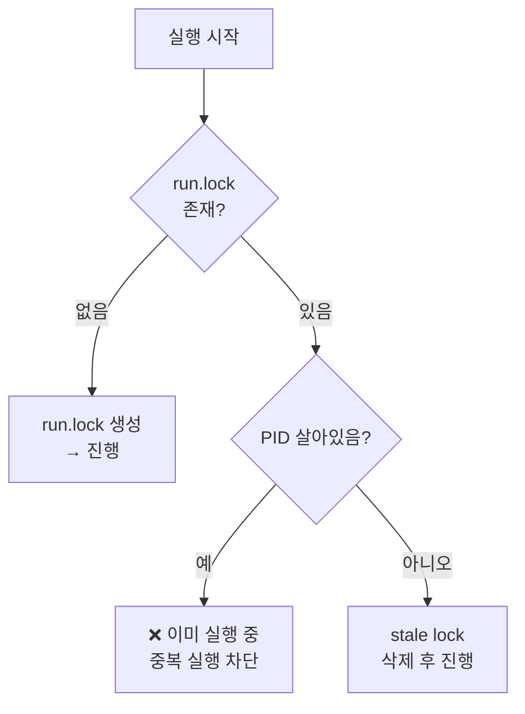

# 06. 운영: 동시성, 에러 복구, 멱등성, 타임아웃, 보안

---

## 1. 동시성 및 충돌 제어

### 1.1 파일 잠금 레지스트리

여러 이슈가 동시에 같은 파일을 수정하면 머지 시 충돌이 발생한다.
worktree 격리만으로는 해결되지 않으므로 `locks.toml`로 관리한다.

```toml
# .cogniq/locks.toml — 프로젝트 루트 (main 브랜치 기준)

[[lock]]
file = "src/api/users.py"
issue_id = "COG-42"
locked_by = "plan"
locked_at = "2026-03-28T10:00:00+09:00"
branch = "agent/cog-42"
```

#### 잠금 생명주기



#### 충돌 발견 시 analysis.toml 추가 필드

```toml
[conflicts]
detected = true
items = [
    { file = "src/api/users.py", held_by = "COG-41", branch = "agent/cog-41" },
]
recommendation = "COG-41 머지 후 진행 권장"
```

### 1.2 머지 충돌 자동 해결

Build가 PR 생성 전에 base 브랜치를 rebase한다.



---

## 2. 에러 복구 및 롤백

### 2.1 실패 시점별 롤백 범위

| 실패 시점 | 롤백 범위 | 산출물 | 이슈 상태 |
|-----------|----------|--------|----------|
| **Plan 실패** | 산출물 없음 (생성 전) | 에러 로그만 이슈 코멘트 | `Backlog` 유지 |
| **Build Phase 1 실패** | worktree `git reset --hard` | `postmortem.toml` | → `Blocked` |
| **Build Phase 2 실패** | worktree `git reset --hard` | `postmortem.toml` + `verify-result.toml` (partial) | → `Blocked` |
| **Build Phase 3 실패** | Phase 3 수정분만 취소 (Phase 2 통과 상태 유지) | `postmortem.toml` + `verify-result.toml` | → `Blocked` |

#### 롤백 후 상태

```
보존:
  ✅ worktree 디렉토리 (사람이 디버깅 가능)
  ✅ .cogniq/ 내 모든 산출물
  ✅ postmortem.toml
  ✅ 브랜치 (reflog에 남음)

제거:
  ❌ 실패한 코드 변경 (git reset --hard)
  ❌ locks.toml에서 해당 이슈의 잠금
```

### 2.2 재시도 흐름



| 경로 | 조건 |
|------|------|
| **A: Build 재시도** | plan.md가 여전히 유효할 때 |
| **B: Plan부터 재시도** | plan.md 자체에 문제 (잘못된 파일 지정 등) |
| **C: 이슈 수정** | 요구사항 자체에 문제 |
| **D: 수동 완료** | AI가 해결 불가능한 문제 |

---

## 3. 멱등성(Idempotency) 보장

### 원칙

> 모든 단계는 "같은 입력으로 다시 실행하면 같은 결과"를 보장한다.
> 중간 중단 후 재실행이 안전해야 한다.

### 단계별 멱등성 규칙

| 단계 | 재실행 시 동작 | 기존 산출물 |
|------|--------------|-----------|
| **Plan** | 처음부터 다시 실행. 코드베이스 현재 상태 기준. | 전부 덮어쓰기 |
| **Build Phase 1** | worktree `git reset --hard` 후 재실행 | `build-result.toml` 덮어쓰기 |
| **Build Phase 2** | 검증만 재실행 (코드 변경 없음) | `verify-result.toml` 덮어쓰기 |
| **Build Phase 3** | 리뷰만 재실행 | `post_review` 섹션 덮어쓰기 |
| **Build Ship** | 기존 PR 있으면 업데이트 (force push + body 갱신). 없으면 새로 생성. | - |

### 실행 잠금 (중복 실행 방지)

```toml
# .cogniq/run.lock

[lock]
issue_id = "COG-42"
stage = "build"                       # plan | build
phase = "phase1"
pid = 12345
started_at = "2026-03-28T10:15:00+09:00"
```



---

## 4. 타임아웃 및 리소스 제한

### 설정

```toml
# .cogniq/config.toml

[limits.plan]
timeout_minutes = 10
max_tokens = 100_000

[limits.build]
timeout_minutes = 30
max_turns = 50
max_tokens = 200_000
max_cost_usd = 5.00

[limits.build.per_phase]
phase1_timeout_minutes = 15           # 구현
phase2_timeout_minutes = 10           # 검증
phase3_timeout_minutes = 5            # adversarial review

[limits.adversarial]
max_fix_cycles = 2                    # 무한 루프 방지
```

### 타임아웃 발생 시 동작

| 초과 항목 | 동작 |
|----------|------|
| **Plan 타임아웃** | 중단. 생성된 산출물까지 저장. 코멘트: "Plan이 10분 내 완료 불가. 이슈 범위 축소 권장." |
| **Build 턴 초과** | 중단. 코드 커밋 안 함. `postmortem.toml` (category: `timeout`). |
| **Build 비용 초과** | 중단. `postmortem.toml` (category: `cost_limit`). 코멘트: "비용 상한 $5.00 초과." |
| **Phase 개별 타임아웃** | 해당 Phase만 중단. Phase 1이면 Build 전체 실패. Phase 3이면 리뷰 없이 PR 생성 (WARNING 표시). |
| **Adversarial 루프 초과** | 2회 반복 후 중단. 남은 CRITICAL을 PR WARNING으로 전환. |

---

## 5. 보안 및 시크릿 관리

### Build 환경 시크릿 접근 범위

```toml
# .cogniq/config.toml

[security.secrets]
# Build에 노출되는 환경변수 허용 목록
allowed_env = [
    "DATABASE_URL",           # 테스트 DB (로컬 또는 CI용)
    "REDIS_URL",
    "TEST_API_KEY",           # 샌드박스 전용 키
]

# 절대 노출하면 안 되는 환경변수
blocked_env = [
    "AWS_SECRET_ACCESS_KEY",
    "STRIPE_SECRET_KEY",
    "PRODUCTION_DATABASE_URL",
]

# Build가 접근할 수 없는 경로
blocked_paths = [
    ".env.production",
    "secrets/",
    "*.pem",
    "*.key",
]
```

### 시크릿 누출 검증

`build-defaults.toml`의 `[verify.secret_scan]` 항목으로 매 Build에서 자동 검사.
시크릿 감지 시 자동 수정 없이 즉시 에스컬레이션 ([03-build-stage.md](./03-build-stage.md) 참조).

---

다음 문서: [07. 정책](./07-policies.md)
