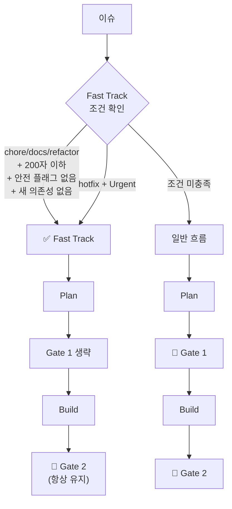
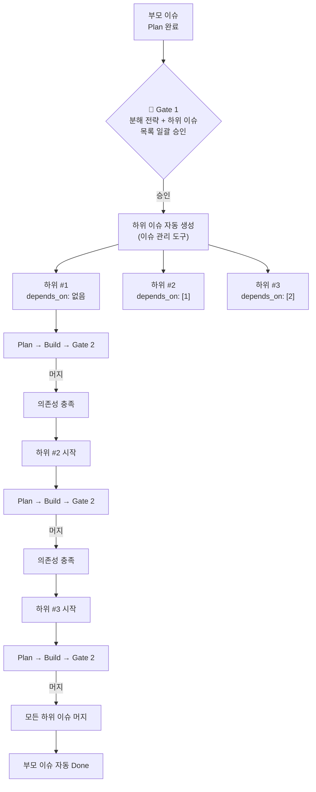
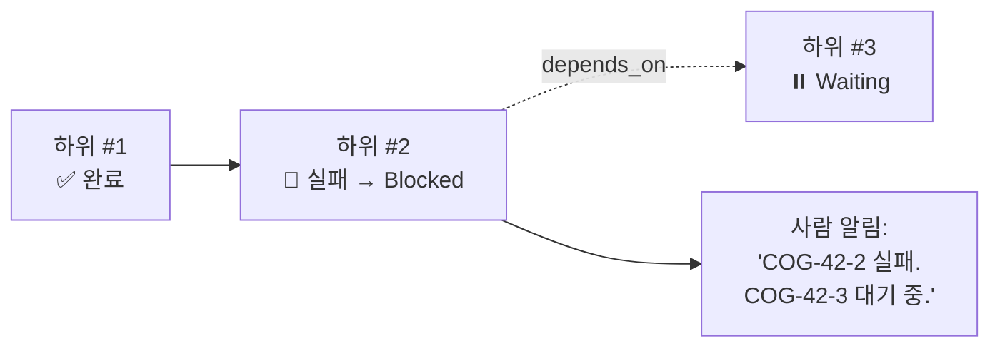

# 07. 정책: 에스컬레이션, Fast Track, 이슈 분해, 의사결정 원칙, 로드맵

---

## 1. 에스컬레이션 기준

### Plan에서 에스컬레이션

| 상황 | AI 행동 | 사람에게 전달 |
|------|---------|-------------|
| 요구사항 모호 | Plan 완료 + 모호한 부분 명시 | "X가 불명확합니다. A 또는 B?" |
| 작업량 > 1일 | Plan 완료 + 규모 추정 | "분할하거나 범위 조정하시겠습니까?" |
| 안전 리스크 | Plan 완료 + ⚠️ 라벨 | "DB 변경 포함. 마이그레이션 확인 필요" |
| 아키텍처 충돌 | Plan 완료 + 충돌 내용 | "현재 패턴과 충돌. 방향 선택 필요" |

### Build에서 에스컬레이션

| 상황 | AI 행동 | 사람에게 전달 |
|------|---------|-------------|
| 검증 2회 실패 | 이전 상태로 롤백 + postmortem | "AC-1 통과 실패. 원인: X" |
| 새 의존성 필요 | 중단 + 코멘트 | "X 라이브러리 필요. 승인?" |
| 스펙 갈림길 | 중단 + 선택지 | "A 방식 vs B 방식?" |
| 예상보다 복잡 | 중단 + 진행 상황 | "범위 조정 필요" |
| 시크릿 감지 | 즉시 중단 | "커밋에 시크릿 포함 감지. 확인 필요." |
| 비용/타임아웃 초과 | 중단 + postmortem | "비용 상한 초과. 이슈 분해 권장." |

---

## 2. Fast Track

다음 조건을 모두 만족하면 Gate 1(계획 승인) 생략:

```
□ 라벨이 chore, docs, refactor 중 하나
□ 설명 200자 이하
□ 안전 플래그 없음
□ 새 의존성 없음

또는:
□ hotfix + Urgent
```

Fast Track 시에도 verification.toml은 생성됨 (technical 항목 위주).
Gate 2(PR 리뷰)는 항상 유지.



---

## 3. 이슈 분해

### 분해 산출물

```toml
# analysis.toml — [decompose] 섹션

[decompose]
should_split = true
strategy = "sequential"              # sequential | parallel | mixed

[[decompose.sub_issues]]
order = 1
title = "User 모델에 update_name 메서드 추가"
description = "..."
depends_on = []
labels = ["backend"]
estimated_complexity = "simple"

[[decompose.sub_issues]]
order = 2
title = "PUT /api/users/{id} 엔드포인트 추가"
description = "..."
depends_on = [1]
labels = ["backend"]
estimated_complexity = "normal"

[[decompose.sub_issues]]
order = 3
title = "프로필 수정 UI 구현"
description = "..."
depends_on = [2]
labels = ["frontend", "ui"]
estimated_complexity = "normal"
```

### 분해 후 실행 흐름



### 분해 규칙

| 항목 | 규칙 |
|------|------|
| **Gate 1 승인** | 부모 이슈에서 일괄 승인. 하위 이슈 개별 Gate 1은 Fast Track 조건 적용. |
| **의존성 순서** | `depends_on`의 이슈가 머지되기 전까지 다음 Build는 대기. |
| **병렬 실행** | `depends_on = []`인 이슈끼리는 동시 실행 가능. 파일 잠금으로 충돌 방지. |
| **하위 이슈 실패** | 해당 이슈만 `Blocked`. 의존 이슈도 `Waiting`. 독립 이슈는 계속 진행. |
| **부모 이슈 완료** | 모든 하위 이슈 머지 시 부모 이슈 자동 `Done`. |

### 하위 이슈 실패 시



---

## 4. 이슈 상태 동기화

### 상태 변경 시점

| 프로세스 이벤트 | 이슈 상태 변경 | 누가 |
|---------------|--------------|------|
| Plan 시작 | `Backlog` → `In Analysis` | AI (자동) |
| Plan 완료 | `In Analysis` → `Plan Complete` | AI (자동) |
| Gate 1 승인 | `Plan Complete` → `Plan Approved` | 사람 |
| Build 시작 | `Plan Approved` → `In Progress` | AI (자동) |
| PR 생성 | `In Progress` → `In Review` | AI (자동) |
| PR 머지 | `In Review` → `Done` | 사람 (Gate 2) |
| Build 실패 | `In Progress` → `Blocked` | AI (자동) |
| 재시도 지시 | `Blocked` → `Plan Approved` 또는 `Backlog` | 사람 |

---

## 5. 의사결정 원칙

```python
COGNIQ_PRINCIPLES = {
    # 실행 판단
    "bias_toward_action": "판단이 애매하면 실행. 대기보다 시도.",
    "scope_limit": "1일 초과 작업은 에스컬레이션",
    "safety_first": "DB/인증/결제/삭제는 ⚠️ 플래그",

    # 검증 계약
    "plan_defines_contract": "Plan이 검증 항목을 정의. Build가 이행.",
    "testable_criteria": "검증 항목은 자동 실행 가능하게 작성",
    "manual_to_checklist": "자동 불가 항목은 PR 체크리스트로",

    # 구현 후 리뷰
    "adversarial_post_build": "구현 후에만 보이는 문제를 다른 모델로 발견",
    "critical_blocks": "CRITICAL은 자동 수정. WARNING은 메모.",
    "retry_twice": "자동 수정 최대 2회. 이후 에스컬레이션",

    # 커뮤니케이션
    "one_question": "에스컬레이션 시 한 번에 한 가지",
    "show_evidence": "판단 근거를 항상 기록",
    "suggest_not_decide": "Reflect 개선은 제안만. 적용은 사람.",
}
```

---

## 6. 구현 로드맵

### Phase 1: Build 검증 파이프라인

| 작업 | 설명 |
|------|------|
| verification.toml 파서 | TOML 읽기 + 항목별 검증 실행기 |
| verify-result.toml 생성 | 검증 결과 기록 |
| lint/test 자동 검증 | verify_method에 따른 실행 |
| 자동 수정 + 재시도 | 최대 2회, 실패 시 에스컬레이션 |
| PR 본문 생성 개선 | 검증 결과 + 체크리스트 포함 |
| 시크릿 스캔 | build-defaults에 secret_scan 추가 |

### Phase 2: Plan 검증 계약 + 컨텍스트

| 작업 | 설명 |
|------|------|
| verification.toml 자동 생성 | PO 분석 → 검증 항목 도출 |
| analysis.toml 구조화 | PO → Dev 컨텍스트 handoff |
| 안전 플래그 시스템 | DB/인증/결제 감지 → ⚠️ + safety 항목 |
| Fast Track 라우팅 | chore/docs/hotfix 자동 진행 |
| design.md 파일 패턴 감지 | 라벨 외 프론트엔드 파일 기반 생성 |
| 파일 잠금 레지스트리 | locks.toml + 충돌 감지 |

### Phase 3: Adversarial Review + Reflect

| 작업 | 설명 |
|------|------|
| 구현 후 리뷰 (Phase 3) | 다른 모델로 코드 리뷰 |
| adversarial 루프 제한 | max_fix_cycles = 2 |
| ReflectAgent | 검증 통과율 트렌드 + 개선 제안 |
| 제안 추적 | suggestion status 관리 + 적용 흐름 |
| 트렌드 비교 | trend.toml 주간 갱신 |
| 복잡도 튜닝 | 실행 결과 기반 자동 조정 제안 |

### Phase 4: 확장

| 작업 | 설명 |
|------|------|
| 의존성 인식 스케줄링 | 하위 이슈 실행 순서 제어 |
| 멀티레포 WorkPool | 레포별 worktree 관리 |
| Auto-merge | CI + 승인 시 자동 머지 |
| 알림 시스템 | Slack 통합 + Gate 리마인더 |
| 타임아웃/비용 제한 | config.toml 기반 리소스 관리 |
| 멱등성 보장 | run.lock + 산출물 덮어쓰기 규칙 |

---

## 7. 성공 지표

| 지표 | 현재 | Phase 1 후 | Phase 3 후 |
|------|------|-----------|-----------|
| verification 1차 통과율 | 없음 | 70% | 85% |
| PR 1차 승인율 | 미측정 | 60% | 80% |
| 이슈당 처리 시간 | 미측정 | < 30분 | < 20분 |
| 사람 개입 횟수/이슈 | ~3회 | 2회 | 1회 (Gate 2만) |
| 에이전트 성공률 | ~70% | 80% | 90% |

---

## 문서 목록

| 파일 | 내용 |
|------|------|
| [01-overview.md](./01-overview.md) | 설계 원칙, 프로세스 개요, 전체 흐름 |
| [02-plan-stage.md](./02-plan-stage.md) | Plan 단계, plan.md/design.md 템플릿 |
| [03-build-stage.md](./03-build-stage.md) | Build 단계, 검증 2계층, adversarial review |
| [04-gates-and-reflect.md](./04-gates-and-reflect.md) | Gate 1/2, Reflect, 알림 |
| [05-artifacts.md](./05-artifacts.md) | 아티팩트 흐름, 디렉토리 구조, Git 정책, 스키마 |
| [06-operations.md](./06-operations.md) | 동시성, 에러 복구, 멱등성, 타임아웃, 보안 |
| [07-policies.md](./07-policies.md) | 에스컬레이션, Fast Track, 분해, 의사결정, 로드맵 |
| [08-artifact-registry.md](./08-artifact-registry.md) | 산출물 원격 저장소 — MongoDB |
| [09-architecture.md](./09-architecture.md) | 서비스 아키텍처, 기술 선택 근거 |
