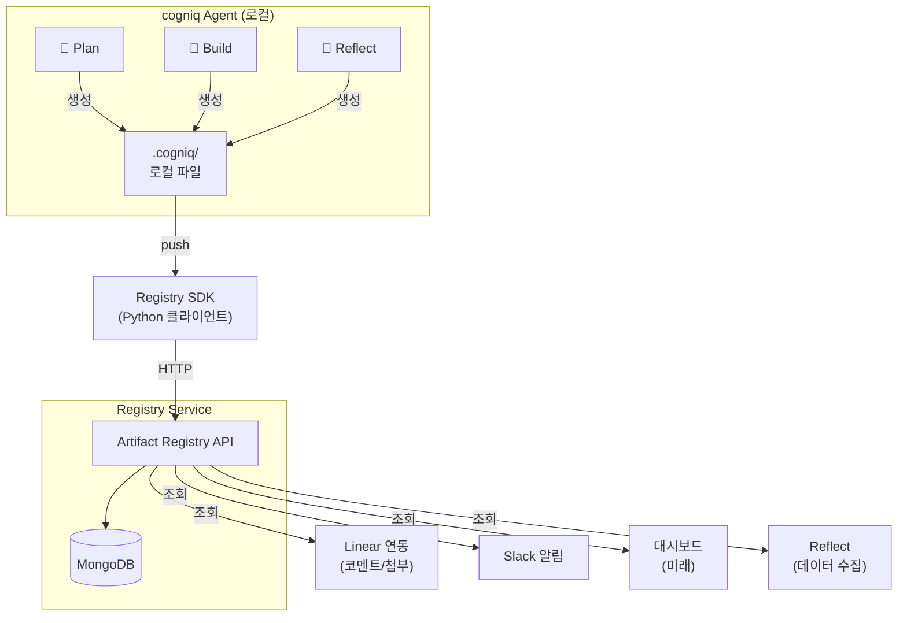
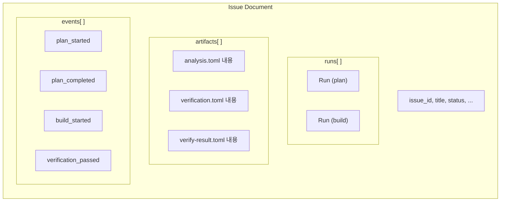
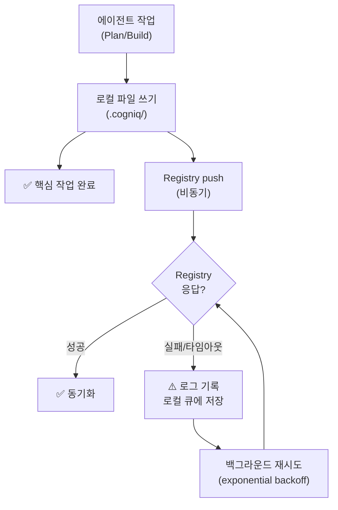

# 08. Artifact Registry: 산출물 원격 저장소

---

## 동기

현재 설계에서 산출물(.cogniq/*.toml, *.md)은 worktree 로컬에만 존재한다.
이로 인해:

- **진행상황 파악이 어렵다** — 사람이 repo를 클론하거나 PR을 열어야 상태를 알 수 있음
- **멀티레포/멀티에이전트 확장이 어렵다** — 이슈 간 산출물을 교차 참조할 수 없음
- **Reflect 데이터 수집이 비효율적** — 여러 worktree를 순회해야 함
- **감사(audit) 추적이 불완전** — 로컬 파일은 삭제/덮어쓰기 시 이력 손실

---

## 설계 원칙

1. **로컬 파일이 Source of Truth.** Registry는 로컬의 복제본(replica)이다. 로컬 파일이 없어도 Registry에서 복원 가능.
2. **Push 기반.** Plan/Build가 산출물 생성 시 Registry에 push. Pull은 조회 전용.
3. **이슈 단위 그룹핑.** 모든 산출물은 이슈 ID를 기준으로 하나의 문서에 모인다.
4. **기존 흐름을 변경하지 않는다.** Registry는 사이드카(sidecar)로 동작. Registry 장애 시에도 Plan/Build는 정상 진행.

---

## 왜 Document DB인가

| 관점 | 데이터 특성 | Document DB 적합 이유 |
|------|-----------|---------------------|
| **스키마 다양성** | artifact type마다 구조가 다름 (analysis.toml ≠ verification.toml ≠ postmortem.toml) | 타입별로 다른 구조를 하나의 컬렉션에 자연스럽게 저장 |
| **이벤트 payload** | event_type마다 payload가 다름 | 유연한 중첩 문서로 payload 구조 제약 없음 |
| **접근 패턴** | "COG-42의 모든 것" — 이슈 중심 조회가 대부분 | 이슈 문서 하나에 runs, artifacts, events가 내장. 한 번의 조회로 전체 컨텍스트 확보 |
| **관계** | Issue → Run → Artifact 단방향. 역참조/복잡한 JOIN 없음 | 중첩 문서로 표현하면 JOIN 자체가 불필요 |
| **쓰기 패턴** | append-only (산출물 push, 이벤트 emit). 수정/삭제 거의 없음 | 문서에 `$push`로 배열 추가. 트랜잭션 불필요 |

> RDB를 사용하면 핵심 컬럼이 전부 JSONB가 되어 Document DB를 흉내내는 셈이 된다.
> 처음부터 Document DB를 쓰면 스키마 관리, 쿼리, 인덱싱이 모두 자연스럽다.

---

## 아키텍처



별도 Blob Storage 없이 MongoDB에 산출물 내용을 직접 저장한다.
TOML/MD 파일은 대부분 수 KB이므로 16MB 문서 제한에 여유가 있다.

---

## 데이터 모델

### 문서 구조

하나의 이슈에 관련된 모든 것이 **하나의 문서**에 모인다.



### 컬렉션 설계

2개 컬렉션만 사용한다.

| 컬렉션 | 역할 | 문서 수 |
|--------|------|--------|
| **`issues`** | 이슈별 전체 컨텍스트 (runs + artifacts + events) | 이슈당 1개 |
| **`metrics`** | Reflect 집계 결과 (주간 회고, 트렌드) | 기간당 1개 |

### issues 컬렉션 — 문서 스키마

```javascript
{
  // ── 이슈 기본 정보 ──
  _id: "COG-42",
  team_key: "COG",
  title: "프로필 수정 기능 추가",
  status: "in_review",              // backlog | in_analysis | plan_complete | plan_approved | in_progress | in_review | done | blocked
  created_at: ISODate("2026-03-28T09:00:00+09:00"),
  updated_at: ISODate("2026-03-28T10:30:00+09:00"),

  // ── 실행 이력 ──
  runs: [
    {
      run_id: "a1b2c3d4",
      stage: "plan",                // plan | build | reflect
      status: "success",            // running | success | fail | timeout
      trigger: "auto",              // auto | manual | retry
      attempt_number: 1,
      config: {
        model: "claude-sonnet-4-6",
        max_turns: 30
      },
      started_at: ISODate("2026-03-28T10:00:00+09:00"),
      completed_at: ISODate("2026-03-28T10:00:45+09:00"),
      duration_seconds: 45,
      cost_usd: 0.08
    },
    {
      run_id: "e5f6g7h8",
      stage: "build",
      status: "success",
      trigger: "auto",
      attempt_number: 1,
      config: {
        model: "claude-sonnet-4-6",
        max_turns: 30
      },
      started_at: ISODate("2026-03-28T10:15:00+09:00"),
      completed_at: ISODate("2026-03-28T10:28:00+09:00"),
      duration_seconds: 780,
      cost_usd: 0.32
    }
  ],

  // ── 산출물 ──
  // artifact type별로 다른 content 구조를 자연스럽게 수용
  artifacts: [
    {
      artifact_id: "art-001",
      run_id: "a1b2c3d4",
      type: "analysis",
      version: 1,
      created_at: ISODate("2026-03-28T10:00:20+09:00"),
      content: {
        // analysis.toml 내용이 그대로 들어감
        meta: { issue_id: "COG-42", created_by: "plan" },
        business: {
          background: "사용자 프로필 수정은 MVP 핵심 기능",
          feasibility: "기존 User 모델 활용, 추가 인프라 불필요",
          completion_criteria: [
            "프로필 페이지에서 이름 수정 가능",
            "빈 이름 입력 시 에러 표시"
          ]
        },
        development: {
          scope: "backend API 1개 엔드포인트 추가",
          changed_files: ["src/api/users.py", "src/models/user.py", "tests/test_users.py"],
          estimated_complexity: "normal",
          suggested_model: "claude-sonnet-4-6"
        },
        safety: { flags: [] }
      }
    },
    {
      artifact_id: "art-002",
      run_id: "a1b2c3d4",
      type: "verification",
      version: 1,
      created_at: ISODate("2026-03-28T10:00:30+09:00"),
      content: {
        // verification.toml 내용이 그대로 들어감
        meta: { issue_id: "COG-42", created_by: "plan" },
        acceptance: [
          { id: "AC-1", description: "프로필 이름 수정 가능", verify_method: "test" },
          { id: "AC-2", description: "빈 이름 400 에러", verify_method: "test" }
        ],
        safety: []
      }
    },
    {
      artifact_id: "art-003",
      run_id: "a1b2c3d4",
      type: "plan_md",
      version: 1,
      created_at: ISODate("2026-03-28T10:00:40+09:00"),
      content_md: "# COG-42: 프로필 수정 기능 추가\n\n## 목표\n..."
      // markdown은 content_md 필드에 문자열로 저장
    },
    {
      artifact_id: "art-004",
      run_id: "e5f6g7h8",
      type: "verify_result",
      version: 1,
      created_at: ISODate("2026-03-28T10:26:00+09:00"),
      content: {
        meta: { issue_id: "COG-42", overall_status: "pass" },
        defaults: {
          lint: { status: "pass", attempts: 2 },
          typecheck: { status: "pass", attempts: 1 },
          test: { status: "pass", attempts: 1, detail: "28 passed" }
        },
        results: [
          { id: "AC-1", status: "pass", detail: "test_update_profile 통과" },
          { id: "AC-2", status: "pass", detail: "test_update_profile_empty_name 통과" }
        ],
        post_review: {
          model_used: "claude-opus-4-6",
          findings: [
            { severity: "warning", description: "race condition 가능성" }
          ]
        }
      }
    },
    {
      artifact_id: "art-005",
      run_id: "e5f6g7h8",
      type: "build_result",
      version: 1,
      created_at: ISODate("2026-03-28T10:28:00+09:00"),
      content: {
        execution: { model: "claude-sonnet-4-6", actual_turns: 12, cost_usd: 0.32 },
        git: {
          branch: "agent/cog-42",
          commits: [
            { hash: "a1b2c3d", message: "COG-42: Add profile update endpoint" }
          ],
          insertions: 120, deletions: 5
        },
        pr: { url: "https://github.com/owner/repo/pull/42", number: 42 }
      }
    }
  ],

  // ── 이벤트 타임라인 ──
  // 이슈의 전체 생명주기를 시간순으로 추적
  events: [
    {
      event_id: "evt-001",
      run_id: "a1b2c3d4",
      type: "plan_started",
      occurred_at: ISODate("2026-03-28T10:00:00+09:00")
    },
    {
      event_id: "evt-002",
      run_id: "a1b2c3d4",
      type: "plan_completed",
      occurred_at: ISODate("2026-03-28T10:00:45+09:00"),
      payload: { artifact_count: 4 }
    },
    {
      event_id: "evt-003",
      type: "gate1_approved",
      occurred_at: ISODate("2026-03-28T10:05:00+09:00"),
      payload: { approved_by: "bob" }
    },
    {
      event_id: "evt-004",
      run_id: "e5f6g7h8",
      type: "build_started",
      occurred_at: ISODate("2026-03-28T10:15:00+09:00"),
      payload: { model: "claude-sonnet-4-6" }
    },
    {
      event_id: "evt-005",
      run_id: "e5f6g7h8",
      type: "build_phase_completed",
      occurred_at: ISODate("2026-03-28T10:23:00+09:00"),
      payload: { phase: "phase1" }
    },
    {
      event_id: "evt-006",
      run_id: "e5f6g7h8",
      type: "verification_passed",
      occurred_at: ISODate("2026-03-28T10:25:00+09:00"),
      payload: { item_id: "AC-1" }
    },
    {
      event_id: "evt-007",
      run_id: "e5f6g7h8",
      type: "verification_passed",
      occurred_at: ISODate("2026-03-28T10:25:30+09:00"),
      payload: { item_id: "AC-2" }
    },
    {
      event_id: "evt-008",
      run_id: "e5f6g7h8",
      type: "build_completed",
      occurred_at: ISODate("2026-03-28T10:28:30+09:00"),
      payload: { pr_url: "https://github.com/owner/repo/pull/42" }
    }
  ],

  // ── 집계 (문서 내 캐시) ──
  summary: {
    total_cost_usd: 0.40,
    total_duration_seconds: 825,
    run_count: 2,
    artifact_count: 5,
    current_stage: "build",
    current_phase: "completed"
  }
}
```

### metrics 컬렉션 — Reflect 집계

```javascript
// Reflect가 주기적으로 생성/갱신
{
  _id: "2026-W13",                    // 연도-주차
  period_start: ISODate("2026-03-21"),
  period_end: ISODate("2026-03-28"),
  issues_processed: 12,

  metrics: {
    success_rate: 0.83,
    avg_duration_seconds: 650,
    avg_cost_usd: 0.28,
    total_cost_usd: 3.36
  },

  verification: {
    first_pass_rate: 0.70,
    most_failed_type: "test",
    auto_fix_success_rate: 0.85
  },

  adversarial: {
    total_findings: 18,
    critical: 2, warning: 7, info: 9,
    most_common_warning: "에러 핸들링 부족"
  },

  complexity_accuracy: {
    overestimated: 2,
    underestimated: 1,
    accurate: 9
  },

  suggestions: [
    {
      id: "SUG-2026-03-28-001",
      type: "prompt",
      description: "테스트 실행 전 DB 연결 확인 단계 추가",
      priority: "high",
      status: "pending"
    }
  ],

  // 트렌드 (최근 N주)
  trend: {
    weeks_tracked: 4,
    success_rate: [0.75, 0.78, 0.80, 0.83],
    first_pass_rate: [0.60, 0.62, 0.68, 0.70],
    avg_cost_usd: [0.35, 0.32, 0.30, 0.28]
  }
}
```

---

## Event Type 목록

| event_type | payload 예시 | 용도 |
|------------|-------------|------|
| `plan_started` | `{}` | 이슈 상태 추적 |
| `plan_completed` | `{ artifact_count: 4 }` | Gate 1 대기 알림 |
| `plan_failed` | `{ error: "..." }` | 실패 알림 |
| `gate1_approved` | `{ approved_by: "bob" }` | 승인 기록 |
| `gate1_rejected` | `{ reason: "..." }` | 반려 기록 |
| `build_started` | `{ model, max_turns }` | 실행 추적 |
| `build_phase_completed` | `{ phase: "phase1", duration_s }` | Phase별 추적 |
| `verification_passed` | `{ item_id: "AC-1" }` | 검증 항목별 추적 |
| `verification_failed` | `{ item_id: "AC-1", attempt }` | 실패 추적 |
| `build_completed` | `{ pr_url }` | Gate 2 대기 알림 |
| `build_failed` | `{ postmortem_id }` | 실패 알림 |
| `gate2_merged` | `{ merged_by }` | 완료 기록 |
| `conflict_detected` | `{ files, held_by }` | 충돌 알림 |
| `escalation` | `{ reason, context }` | 에스컬레이션 알림 |
| `cost_warning` | `{ current, limit }` | 비용 경고 |

---

## Artifact Type 목록

| type | 생성 단계 | content 필드 | 설명 |
|------|----------|-------------|------|
| `issue_snapshot` | Plan | `content` (object) | issue.toml 내용 |
| `analysis` | Plan | `content` (object) | analysis.toml 내용 |
| `verification` | Plan | `content` (object) | verification.toml 내용 |
| `plan_md` | Plan | `content_md` (string) | plan.md 원문 |
| `design_md` | Plan | `content_md` (string) | design.md 원문 (조건부) |
| `build_result` | Build | `content` (object) | build-result.toml 내용 |
| `verify_result` | Build | `content` (object) | verify-result.toml 내용 |
| `review_md` | Build | `content_md` (string) | review.md 원문 |
| `postmortem` | Build | `content` (object) | postmortem.toml 내용 |

TOML 파일은 파싱하여 `content` (object)로 저장, Markdown은 `content_md` (string)로 저장.
이를 통해 TOML 기반 산출물은 필드 단위 쿼리가 가능하다:

```javascript
// "safety flag가 있는 이슈 찾기"
db.issues.find({ "artifacts.content.safety.flags": { $ne: [] } })

// "verification 1차 통과 실패한 항목 찾기"
db.issues.find({ "artifacts.content.results.status": "fail" })
```

---

## 인덱스

```javascript
// issues 컬렉션
db.issues.createIndex({ status: 1 })
db.issues.createIndex({ team_key: 1, status: 1 })
db.issues.createIndex({ "events.type": 1, "events.occurred_at": -1 })
db.issues.createIndex({ "artifacts.type": 1 })
db.issues.createIndex({ "runs.stage": 1, "runs.status": 1 })
db.issues.createIndex({ updated_at: -1 })

// metrics 컬렉션
db.metrics.createIndex({ period_start: -1 })
```

---

## API 설계

### 기본 경로

```
Base URL: /api/v1
```

### 엔드포인트

#### 이슈

| Method | Path | 설명 |
|--------|------|------|
| `GET` | `/issues` | 이슈 목록 (필터: status, team_key) |
| `GET` | `/issues/{issue_id}` | 이슈 문서 전체 (runs + artifacts + events + summary) |
| `PUT` | `/issues/{issue_id}/status` | 이슈 상태 업데이트 |

#### Run

| Method | Path | 설명 |
|--------|------|------|
| `POST` | `/issues/{issue_id}/runs` | Run 추가 (Plan/Build 시작 시) |
| `PATCH` | `/issues/{issue_id}/runs/{run_id}` | Run 상태 업데이트 (완료/실패) |

#### Artifact

| Method | Path | 설명 |
|--------|------|------|
| `POST` | `/issues/{issue_id}/artifacts` | Artifact 추가 (TOML → JSON 변환하여 저장) |
| `GET` | `/issues/{issue_id}/artifacts?type=verification` | 특정 타입 필터 |
| `GET` | `/issues/{issue_id}/artifacts/latest?type=verification` | 특정 타입 최신 버전 |

#### Event

| Method | Path | 설명 |
|--------|------|------|
| `POST` | `/issues/{issue_id}/events` | 이벤트 추가 |
| `GET` | `/issues/{issue_id}/events` | 이슈 타임라인 |
| `GET` | `/events/stream` | SSE 스트림 (실시간 구독) |

#### 대시보드/집계

| Method | Path | 설명 |
|--------|------|------|
| `GET` | `/dashboard/active` | 진행 중인 이슈 목록 + 단계 |
| `GET` | `/dashboard/metrics?period=4w` | 기간별 집계 |
| `GET` | `/dashboard/issues/{issue_id}/timeline` | 이슈 타임라인 (이벤트 + 산출물 통합 뷰) |

### 응답 예시: `GET /issues/COG-42`

한 번의 조회로 이슈의 전체 컨텍스트를 반환한다.
MongoDB에서는 `findOne({ _id: "COG-42" })` 한 번이면 된다.

```json
{
  "_id": "COG-42",
  "team_key": "COG",
  "title": "프로필 수정 기능 추가",
  "status": "in_review",
  "summary": {
    "total_cost_usd": 0.40,
    "total_duration_seconds": 825,
    "current_stage": "build",
    "current_phase": "completed"
  },
  "runs": [ "..." ],
  "artifacts": [ "..." ],
  "events": [ "..." ]
}
```

### 응답 예시: `GET /dashboard/active`

```json
{
  "active_issues": [
    {
      "_id": "COG-42",
      "title": "프로필 수정 기능 추가",
      "status": "in_review",
      "summary": {
        "current_stage": "build",
        "current_phase": "completed",
        "total_cost_usd": 0.40
      },
      "last_event": {
        "type": "build_completed",
        "occurred_at": "2026-03-28T10:28:30+09:00"
      }
    },
    {
      "_id": "COG-43",
      "title": "비밀번호 변경 API",
      "status": "in_progress",
      "summary": {
        "current_stage": "build",
        "current_phase": "phase2",
        "total_cost_usd": 0.15
      },
      "last_event": {
        "type": "verification_passed",
        "occurred_at": "2026-03-28T11:05:00+09:00",
        "payload": { "item_id": "AC-1" }
      }
    }
  ]
}
```

---

## 문서 크기 관리

이슈 문서가 커지는 것을 방지하는 전략:

| 상황 | 대응 |
|------|------|
| **산출물 누적** | artifact는 최신 버전만 문서에 유지. 이전 버전은 `artifacts_archive` 컬렉션으로 이동. |
| **이벤트 누적** | 완료된 이슈의 이벤트는 요약 후 상세 이벤트를 `events_archive`로 이동. |
| **MD 파일 크기** | plan.md(150줄 제한), design.md(100줄 제한)이므로 수 KB 수준. 문제 없음. |
| **최대 크기** | 이슈 문서 최대 약 500KB 예상. MongoDB 16MB 제한 대비 여유 충분. |

```javascript
// 아카이브 작업 (이슈 완료 후 비동기)
function archiveCompletedIssue(issueId) {
  const issue = db.issues.findOne({ _id: issueId });

  // 이전 버전 산출물 아카이브
  const latestByType = {};
  issue.artifacts.forEach(a => {
    if (!latestByType[a.type] || a.version > latestByType[a.type].version) {
      latestByType[a.type] = a;
    }
  });
  const archived = issue.artifacts.filter(a => a !== latestByType[a.type]);
  if (archived.length > 0) {
    db.artifacts_archive.insertMany(archived.map(a => ({ ...a, issue_id: issueId })));
    db.issues.updateOne(
      { _id: issueId },
      { $set: { artifacts: Object.values(latestByType) } }
    );
  }
}
```

---

## Registry SDK (에이전트 클라이언트)

### 인터페이스

```python
from cogniq.registry import RegistryClient

class RegistryClient:
    """Artifact Registry 클라이언트.

    Registry 장애 시에도 에이전트는 정상 동작해야 한다.
    모든 메서드는 실패 시 로그만 남기고 예외를 전파하지 않는다 (fire-and-forget).
    """

    def __init__(self, base_url: str, timeout_seconds: int = 5):
        ...

    # ── Run 관리 ──

    def start_run(self, issue_id: str, stage: str, config: dict | None = None) -> str:
        """Run 추가. run_id 반환."""
        ...

    def complete_run(self, issue_id: str, run_id: str) -> None:
        """Run 완료 처리."""
        ...

    def fail_run(self, issue_id: str, run_id: str, error: str | None = None) -> None:
        """Run 실패 처리."""
        ...

    # ── Artifact 업로드 ──

    def push_artifact(self, issue_id: str, run_id: str, artifact_type: str, file_path: Path) -> str:
        """로컬 TOML/MD 파일을 Registry에 push.
        TOML → JSON 변환 후 content에 저장.
        MD → content_md에 문자열 저장.
        같은 type의 기존 artifact가 있으면 version 증가.
        """
        ...

    def push_artifacts(self, issue_id: str, run_id: str, artifacts: list[tuple[str, Path]]) -> list[str]:
        """여러 artifact를 한 번에 push (배치)."""
        ...

    # ── Event 기록 ──

    def emit_event(self, issue_id: str, event_type: str, run_id: str | None = None, payload: dict | None = None) -> None:
        """이벤트 추가."""
        ...

    # ── 조회 ──

    def get_issue(self, issue_id: str) -> dict | None:
        """이슈 문서 전체 조회."""
        ...

    def get_latest_artifact(self, issue_id: str, artifact_type: str) -> dict | None:
        """특정 타입의 최신 artifact content 반환."""
        ...
```

### 에이전트 통합 예시

```python
async def run_plan(issue_id: str):
    registry = RegistryClient(base_url=config.registry_url)
    run_id = registry.start_run(issue_id, stage="plan")

    try:
        registry.emit_event(issue_id, "plan_started", run_id=run_id)

        # 1. 이슈 분석 → 로컬 저장 → Registry push
        issue_toml = analyze_issue(issue_id)
        write_local(".cogniq/issue.toml", issue_toml)
        registry.push_artifact(issue_id, run_id, "issue_snapshot", Path(".cogniq/issue.toml"))

        # 2. 코드베이스 탐색
        analysis_toml = explore_codebase(issue_toml)
        write_local(".cogniq/analysis.toml", analysis_toml)
        registry.push_artifact(issue_id, run_id, "analysis", Path(".cogniq/analysis.toml"))

        # 3. 검증 항목 + plan.md (배치 push)
        verification_toml = define_verification(issue_toml, analysis_toml)
        write_local(".cogniq/verification.toml", verification_toml)
        plan_md = generate_plan(issue_toml, analysis_toml)
        write_local(".cogniq/plan.md", plan_md)
        registry.push_artifacts(issue_id, run_id, [
            ("verification", Path(".cogniq/verification.toml")),
            ("plan_md", Path(".cogniq/plan.md")),
        ])

        registry.emit_event(issue_id, "plan_completed", run_id=run_id, payload={"artifact_count": 4})
        registry.complete_run(issue_id, run_id)

    except Exception as e:
        registry.emit_event(issue_id, "plan_failed", run_id=run_id, payload={"error": str(e)})
        registry.fail_run(issue_id, run_id, error=str(e))
        raise
```

---

## 장애 격리



| 항목 | 규칙 |
|------|------|
| **타임아웃** | Registry 호출 5초 타임아웃. 초과 시 로그 후 계속 진행. |
| **재시도** | 실패 시 로컬 큐(`~/.cogniq/push-queue/`)에 저장. 백그라운드 exponential backoff 재시도. |
| **에이전트 영향** | Registry 실패가 Plan/Build 성공/실패에 영향 없음. |
| **복원** | Registry 복구 후 미전송 큐 일괄 push. |
| **정합성** | 로컬 파일이 항상 Source of Truth. 불일치 시 로컬 기준 재push. |

---

## 기술 스택

| 구성요소 | 선택 | 이유 |
|---------|------|------|
| **API 프레임워크** | FastAPI | Python 동일 언어. 비동기. OpenAPI 자동 생성. |
| **DB** | MongoDB | 이슈 중심 문서 모델. 유연한 스키마. artifact 내용 직접 저장. |
| **실시간 스트림** | SSE (Server-Sent Events) | Change Stream → SSE로 Slack/대시보드 연동. |
| **SDK** | httpx (async) | 에이전트 비동기 호출 + 타임아웃 제어. |

### MongoDB Change Stream 활용

```python
# SSE 엔드포인트 — 실시간 이벤트 스트림
@app.get("/events/stream")
async def event_stream(issue_id: str | None = None):
    pipeline = []
    if issue_id:
        pipeline.append({"$match": {"fullDocument._id": issue_id}})

    async def generate():
        async with db.issues.watch(pipeline) as stream:
            async for change in stream:
                if change["operationType"] in ("update", "insert"):
                    # events 배열에 추가된 최신 이벤트만 전송
                    yield f"data: {json.dumps(change['updateDescription'])}\n\n"

    return StreamingResponse(generate(), media_type="text/event-stream")
```

---

## 프로세스 흐름 변경 (기존 대비)

기존 흐름에 Registry push 지점만 추가. 기존 동작은 변경 없음.

```mermaid
flowchart TD
    subgraph Plan["🤖 Plan"]
        P1["분석"] -->|"push: issue_snapshot, analysis"| P2["검증 항목 정의"]
        P2 -->|"push: verification"| P3["문서 생성"]
        P3 -->|"push: plan_md, design_md"| P4["Plan 완료"]
        P4 -->|"event: plan_completed"| PEnd["→ Gate 1"]
    end

    subgraph Gate1["🧑 Gate 1"]
        G1["승인/반려"]
        G1 -->|"event: gate1_approved"| G1End[""]
    end

    subgraph Build["🤖 Build"]
        B1["Phase 1: 구현"]
        B1 -->|"event: build_phase_completed"| B2["Phase 2: 검증"]
        B2 -->|"event: verification_passed (각 항목)"| B3["Phase 3: 리뷰"]
        B3 -->|"push: verify_result, build_result"| B4["PR 생성"]
        B4 -->|"event: build_completed"| BEnd["→ Gate 2"]
    end

    subgraph Reflect["🤖 Reflect"]
        R1["Registry에서 데이터 조회<br/>(GET /issues)"]
        R1 --> R2["분석 + 트렌드"]
        R2 -->|"metrics 컬렉션에 저장"| R3["제안 생성"]
    end
```

### Reflect 개선

```
기존: Reflect → 각 worktree의 .cogniq/ 순회 → build-result, verify-result 수집
이후: Reflect → GET /issues?status=done → 한 번의 쿼리로 전체 데이터 수집
```

---

## 구현 로드맵

### Phase 1: 코어

| 작업 | 설명 |
|------|------|
| MongoDB 셋업 + 컬렉션/인덱스 | issues, metrics 컬렉션 생성 |
| FastAPI 서버 골격 | CRUD 엔드포인트 |
| RegistryClient SDK | Python 클라이언트 + fire-and-forget |
| Plan 에이전트 통합 | 산출물 push + 이벤트 emit |
| Build 에이전트 통합 | 산출물 push + 검증 항목별 이벤트 |

### Phase 2: 소비자 연동

| 작업 | 설명 |
|------|------|
| Change Stream + SSE | 실시간 이벤트 스트림 |
| Linear 연동 | 이슈 코멘트에 타임라인 자동 게시 |
| Slack 알림 | SSE 구독 → Slack 전송 |
| Reflect 연동 | Registry API로 데이터 수집 |
| 로컬 큐 + 재시도 | 장애 시 미전송 큐잉 |

### Phase 3: 대시보드

| 작업 | 설명 |
|------|------|
| 대시보드 API | 집계 엔드포인트 (Aggregation Pipeline) |
| 웹 UI | 이슈 타임라인 + 산출물 뷰어 + 비용 추적 |
| 아카이브 자동화 | 완료 이슈의 이전 버전 정리 |

---

## 문서 목록

| 파일 | 내용 |
|------|------|
| [01-overview.md](./01-overview.md) | 설계 원칙, 프로세스 개요, 전체 흐름 |
| [02-plan-stage.md](./02-plan-stage.md) | Plan 단계, plan.md/design.md 템플릿 |
| [03-build-stage.md](./03-build-stage.md) | Build 단계, 검증 2계층, adversarial review |
| [04-gates-and-reflect.md](./04-gates-and-reflect.md) | Gate 1/2, Reflect, 알림 |
| [05-artifacts.md](./05-artifacts.md) | 아티팩트 흐름, 디렉토리 구조, Git 정책, 스키마 |
| [06-operations.md](./06-operations.md) | 동시성, 에러 복구, 멱등성, 타임아웃, 보안 |
| [07-policies.md](./07-policies.md) | 에스컬레이션, Fast Track, 분해, 의사결정, 로드맵 |
| **[08-artifact-registry.md](./08-artifact-registry.md)** | **산출물 원격 저장소 — MongoDB (이 문서)** |
