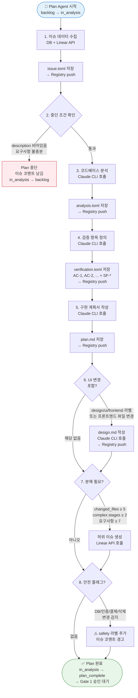
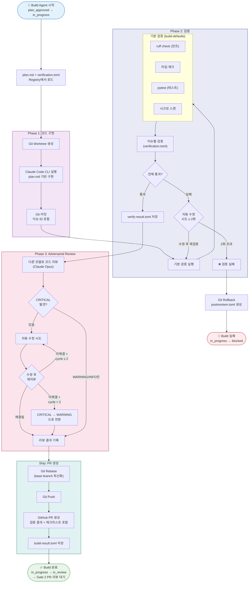
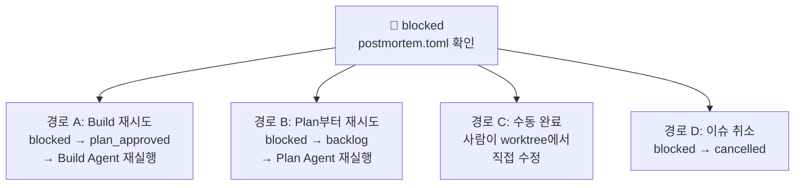

# Issue State Diagram

`state_machine.py`, `engine.py`, `plan_agent.py`, `build_agent.py` 구현 기반.
백엔드 상태를 프론트엔드에 그대로 전달한다 (매핑 레이어 없음).

---

## 프론트엔드 파이프라인

백엔드의 9개 상태가 프론트엔드에 직접 노출된다.

```mermaid
flowchart LR
    backlog["backlog<br/>이슈 등록"]
    in_analysis["in_analysis<br/>AI 분석"]
    plan_complete["plan_complete<br/>Gate 1 승인 대기"]
    plan_approved["plan_approved<br/>승인됨"]
    in_progress["in_progress<br/>AI 구현"]
    in_review["in_review<br/>Gate 2 PR 리뷰"]
    done["done<br/>완료"]

    backlog --> in_analysis --> plan_complete --> plan_approved --> in_progress --> in_review --> done

    style backlog fill:#f5f5f5,stroke:#9e9e9e
    style in_analysis fill:#e3f2fd,stroke:#1976d2
    style plan_complete fill:#fff3e0,stroke:#f57c00
    style plan_approved fill:#e8f5e9,stroke:#388e3c
    style in_progress fill:#e3f2fd,stroke:#1976d2
    style in_review fill:#fff3e0,stroke:#f57c00
    style done fill:#e8f5e9,stroke:#388e3c
```

| 상태 | 단계 | 주체 | 설명 |
|------|------|------|------|
| `backlog` | 이슈 등록 | — | 초기 상태. 실패/반려 시에도 돌아옴 |
| `in_analysis` | AI 분석 | 🤖 Plan Agent | 코드 분석 + 산출물 생성 중 |
| `plan_complete` | Gate 1 승인 대기 | ⏸️ 사람 | Plan 완료. 승인/반려 판단 |
| `plan_approved` | 승인됨 | — | Gate 1 통과. Build 시작 직전 |
| `in_progress` | AI 구현 | 🤖 Build Agent | 구현 + 검증 + 리뷰 실행 중 |
| `blocked` | AI 구현 (실패) | ⏸️ 사람 | Build 실패. 재시도/재Plan 판단 |
| `in_review` | Gate 2 PR 리뷰 | ⏸️ 사람 | PR 생성됨. 머지 대기 |
| `done` | 완료 | ✅ | PR 머지 완료 |
| `cancelled` | 취소 | ❌ | 모든 상태에서 진입. 재오픈 가능 |

---

## 전체 상태 전이

```mermaid
stateDiagram-v2
    [*] --> backlog

    %% ── 정상 흐름 ──
    backlog --> in_analysis : 🤖 issue_created\nPlan Agent 시작
    in_analysis --> plan_complete : 🤖 plan_completed\n산출물 생성 완료
    plan_complete --> plan_approved : 🧑 gate1_approved
    plan_complete --> plan_approved : 🤖 fast_track 자동 승인
    plan_approved --> in_progress : 🤖 build_started\nBuild Agent 시작
    in_progress --> in_review : 🤖 build_completed\nPR 생성
    in_review --> done : 🧑 gate2_merged\nPR 머지
    done --> [*]

    %% ── 실패 및 복구 ──
    in_analysis --> backlog : 🤖 plan_failed
    plan_complete --> backlog : 🧑 gate1_rejected
    plan_approved --> backlog : 🧑 re-plan 요청
    in_progress --> blocked : 🤖 build_failed
    in_review --> in_progress : 🧑 수정 요청

    %% ── Blocked 복구 ──
    blocked --> plan_approved : 🧑 Build 재시도
    blocked --> backlog : 🧑 Plan부터 재시도

    %% ── 취소 ──
    backlog --> cancelled : 취소
    in_analysis --> cancelled : 취소
    plan_complete --> cancelled : 취소
    plan_approved --> cancelled : 취소
    in_progress --> cancelled : 취소
    in_review --> cancelled : 취소
    blocked --> cancelled : 취소
    cancelled --> backlog : 🧑 재오픈
```

---

## AI 분석 단계 (Plan Agent) 내부 흐름

`plan_agent.py` 구현 기반. `backlog` → `in_analysis` → `plan_complete` 구간.

### Plan Agent 산출물

| 순서 | 산출물 | 조건 | 설명 |
|------|--------|------|------|
| 1 | `issue.toml` | 항상 | 이슈 데이터 스냅샷 |
| 2 | `analysis.toml` | 항상 | 비즈니스/개발/디자인/안전 분석 |
| 3 | `verification.toml` | 항상 | 검증 계약서 (AC-*, SF-*) |
| 4 | `plan.md` | 항상 | 구현 계획서 (150줄 이내) |
| 5 | `design.md` | 조건부 | UI/UX 설계서 (100줄 이내) |

---

## AI 구현 단계 (Build Agent) 내부 흐름

`build_agent.py` 구현 기반. `plan_approved` → `in_progress` → `in_review` 또는 `blocked` 구간.

### Build Agent 산출물

| Phase | 산출물 | 조건 | 설명 |
|-------|--------|------|------|
| Phase 1 | 코드 변경 + 커밋 | 항상 | Claude Code CLI로 구현한 코드 |
| Phase 2 | `verify-result.toml` | 항상 | 기본 검증 + 이슈별 검증 결과 |
| Phase 3 | `verify-result.toml` (post_review 추가) | 항상 | adversarial review findings |
| Ship | `build-result.toml` | 성공 시 | PR URL, 비용, 토큰, Git 정보 |
| 실패 시 | `postmortem.toml` | 실패 시 | 실패 원인, 카테고리, 시도 내역 |

### Build 실패 시 복구 경로

---

## 오케스트레이터 이벤트 → 상태 전이 → 후속 액션

```mermaid
flowchart TD
    subgraph issue_created["🔵 issue_created"]
        IC["backlog → in_analysis"]
        IC --> IC2["emit: plan_started"]
        IC2 --> IC3["scheduler.enqueue(plan)"]
    end

    subgraph plan_completed["🔵 plan_completed"]
        PC["in_analysis → plan_complete"]
        PC --> FT{"Fast Track?"}
        FT -->|"Yes"| FT1["→ plan_approved"]
        FT1 --> FT2["scheduler.enqueue(build)"]
        FT -->|"No"| FT3["Slack: 승인 대기"]
    end

    subgraph plan_failed["🔴 plan_failed"]
        PF["in_analysis → backlog"]
        PF --> PF2["Slack: Plan 실패"]
    end

    subgraph gate1_approved["🟢 gate1_approved"]
        G1["plan_complete → plan_approved"]
        G1 --> G1B["→ in_progress"]
        G1B --> G1C["scheduler.enqueue(build)"]
    end

    subgraph gate1_rejected["🔴 gate1_rejected"]
        G1R["plan_complete → backlog"]
    end

    subgraph build_completed["🔵 build_completed"]
        BC["in_progress → in_review"]
        BC --> BC2["Slack: PR 리뷰 대기"]
    end

    subgraph build_failed["🔴 build_failed"]
        BF["in_progress → blocked"]
        BF --> BF2["Slack: Build 실패"]
    end

    subgraph gate2_merged["🟢 gate2_merged"]
        G2["in_review → done"]
        G2 --> G2N["Slack: 완료"]
    end
```

